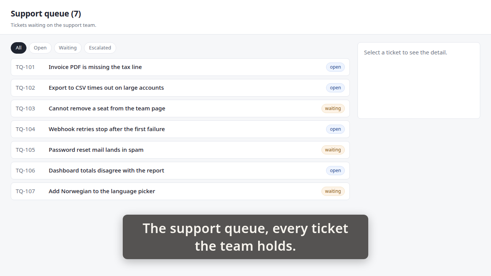
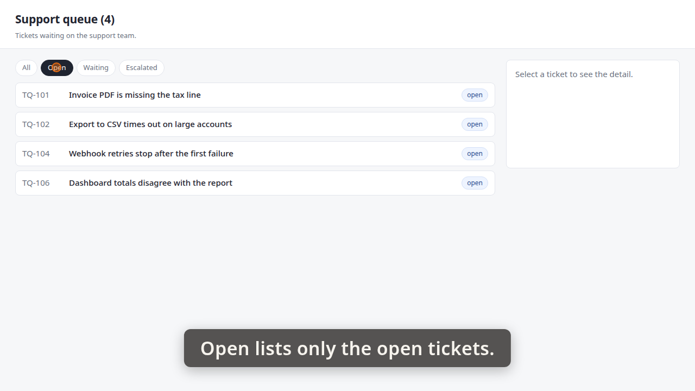
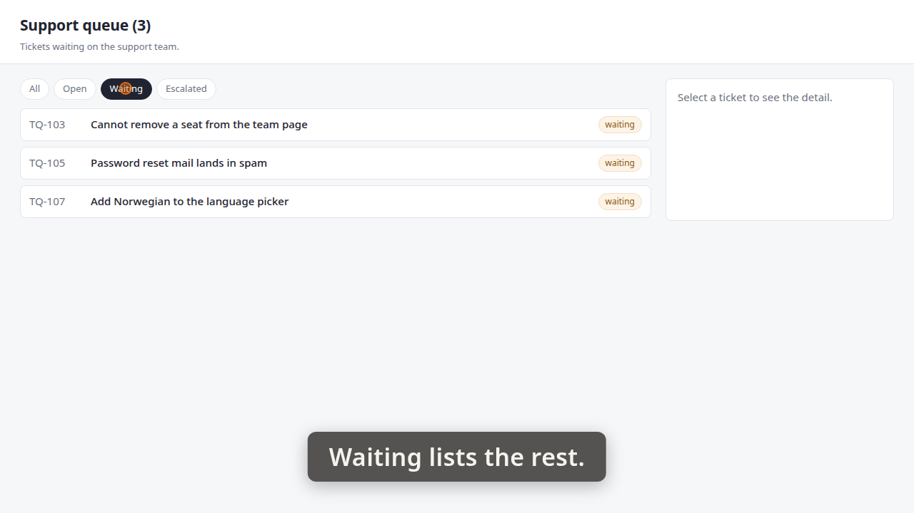
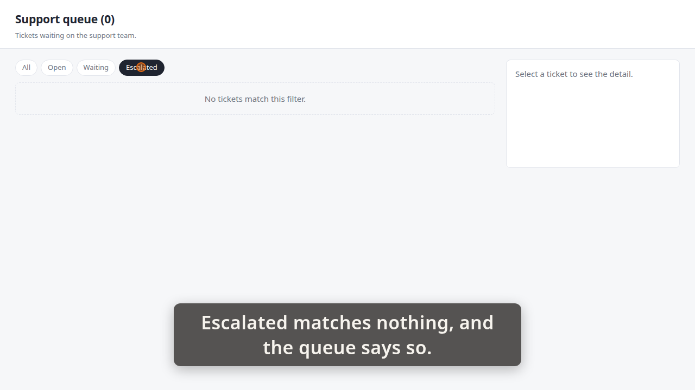
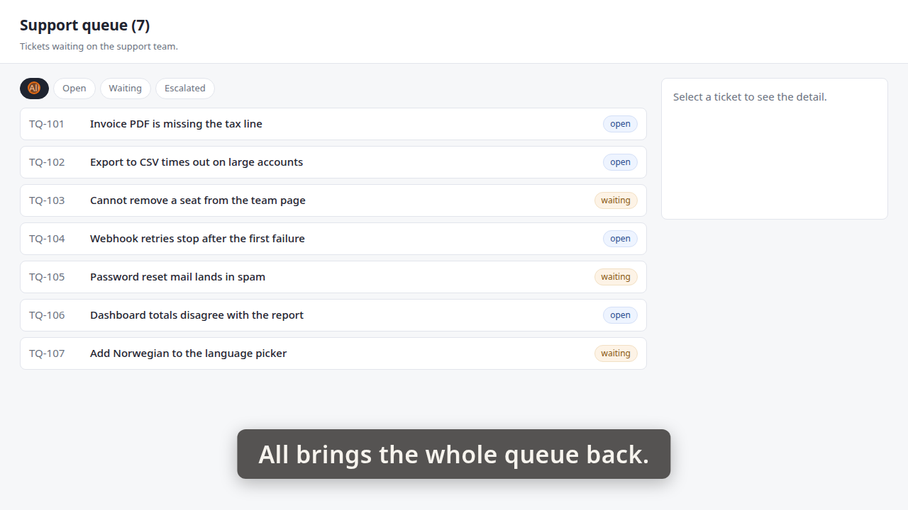
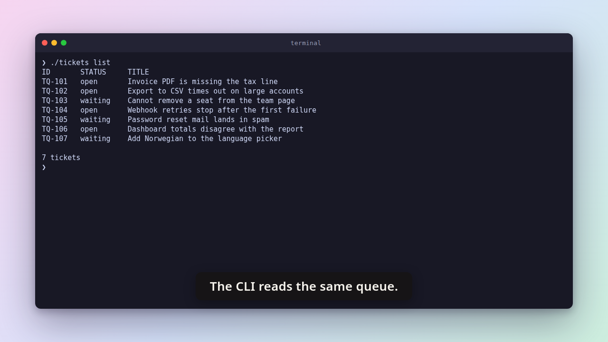
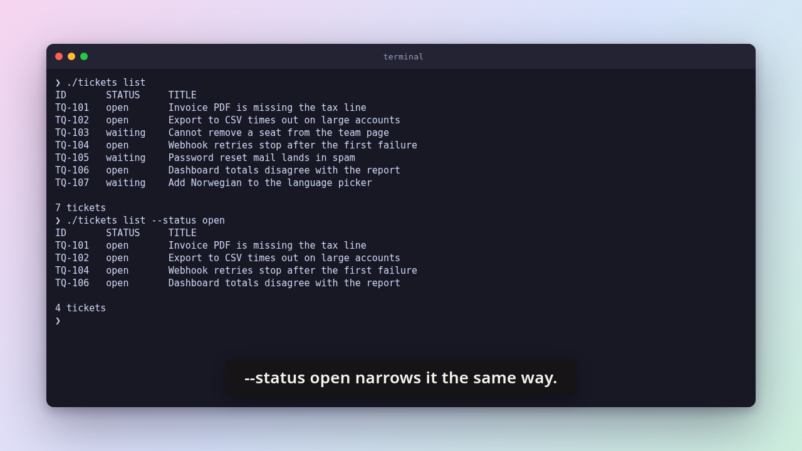
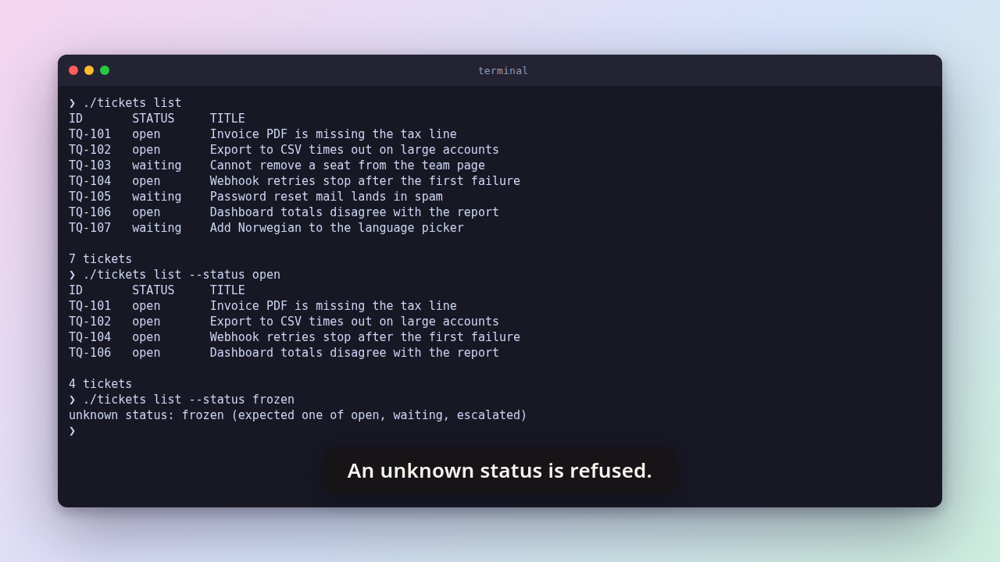

# Demo timeline

`demo.mp4` · mixed · 61.4s · 48 beats

Written by the demo-video recorder when it stitched the segments below — do not edit it by hand, re-stitch instead.

Stitched from 2 segments, in order: `part1` (0.00–37.24s), `part2` (37.24–61.40s). Beat times below are on the stitched video's clock.

| # | start | end | verb | target | exit | caption |
|---:|---:|---:|---|---|---:|---|
| 0 | 0.43 | 0.99 | `goto` | `/` |  |  |
| 1 | 0.99 | 1.02 | `wait_for` | `.ticket` |  |  |
| 2 | 1.02 | 4.37 | `caption` |  |  | The support queue, every ticket the team holds. |
| 3 | 4.37 | 5.90 | `hold` |  |  | The support queue, every ticket the team holds. |
| 4 | 5.90 | 5.95 | `shot` | `01-queue` |  | The support queue, every ticket the team holds. |
| 5 | 5.95 | 8.96 | `caption` |  |  | A status filter sits above the list. |
| 6 | 8.96 | 9.29 | `spotlight` | `#status-filter` |  | A status filter sits above the list. |
| 7 | 9.29 | 10.82 | `hold` |  |  | A status filter sits above the list. |
| 8 | 10.82 | 11.41 | `spotlight` |  |  | A status filter sits above the list. |
| 9 | 11.41 | 14.07 | `caption` |  |  | Open lists only the open tickets. |
| 10 | 14.07 | 15.01 | `click` | `button[data-status='open']` |  | Open lists only the open tickets. |
| 11 | 15.01 | 16.54 | `hold` |  |  | Open lists only the open tickets. |
| 12 | 16.54 | 16.59 | `shot` | `02-open` |  | Open lists only the open tickets. |
| 13 | 16.59 | 19.60 | `caption` |  |  | The heading counts what the filter left. |
| 14 | 19.60 | 19.93 | `spotlight` | `#queue-heading` |  | The heading counts what the filter left. |
| 15 | 19.93 | 21.45 | `hold` |  |  | The heading counts what the filter left. |
| 16 | 21.45 | 22.03 | `spotlight` |  |  | The heading counts what the filter left. |
| 17 | 22.03 | 24.02 | `caption` |  |  | Waiting lists the rest. |
| 18 | 24.02 | 24.93 | `click` | `button[data-status='waiting']` |  | Waiting lists the rest. |
| 19 | 24.93 | 26.46 | `hold` |  |  | Waiting lists the rest. |
| 20 | 26.46 | 26.50 | `shot` | `03-waiting` |  | Waiting lists the rest. |
| 21 | 26.50 | 29.84 | `caption` |  |  | Escalated matches nothing, and the queue says so. |
| 22 | 29.84 | 30.76 | `click` | `button[data-status='escalated']` |  | Escalated matches nothing, and the queue says so. |
| 23 | 30.76 | 32.29 | `hold` |  |  | Escalated matches nothing, and the queue says so. |
| 24 | 32.29 | 32.33 | `shot` | `04-escalated` |  | Escalated matches nothing, and the queue says so. |
| 25 | 32.33 | 35.01 | `caption` |  |  | All brings the whole queue back. |
| 26 | 35.01 | 35.96 | `click` | `button[data-status='all']` |  | All brings the whole queue back. |
| 27 | 35.96 | 37.48 | `hold` |  |  | All brings the whole queue back. |
| 28 | 37.48 | 37.52 | `shot` | `05-all` |  | All brings the whole queue back. |
| 29 | 37.52 | 37.84 | `caption` |  |  |  |
| 30 | 37.53 | 40.35 | `interlude` | `card` |  | The same filter, on the command line. |
| 31 | 40.35 | 40.95 | `interlude` | `card` |  |  |
| 32 | 40.95 | 43.60 | `caption` |  |  | The CLI reads the same queue. |
| 33 | 43.60 | 44.44 | `run` | `./tickets list` | 0 | The CLI reads the same queue. |
| 34 | 44.44 | 44.65 | `wait_for_prompt` |  |  | The CLI reads the same queue. |
| 35 | 44.65 | 46.16 | `hold` |  |  | The CLI reads the same queue. |
| 36 | 46.16 | 46.23 | `shot` | `06-cli-list` |  | The CLI reads the same queue. |
| 37 | 46.23 | 49.22 | `caption` |  |  | --status open narrows it the same way. |
| 38 | 49.22 | 50.72 | `run` | `./tickets list --status open` | 0 | --status open narrows it the same way. |
| 39 | 50.72 | 50.93 | `wait_for_prompt` |  |  | --status open narrows it the same way. |
| 40 | 50.93 | 52.43 | `hold` |  |  | --status open narrows it the same way. |
| 41 | 52.43 | 52.50 | `shot` | `07-cli-open` |  | --status open narrows it the same way. |
| 42 | 52.50 | 54.81 | `caption` |  |  | An unknown status is refused. |
| 43 | 54.81 | 56.40 | `run` | `./tickets list --status frozen` | 2 | An unknown status is refused. |
| 44 | 56.40 | 56.61 | `wait_for_prompt` |  |  | An unknown status is refused. |
| 45 | 56.61 | 58.11 | `hold` |  |  | An unknown status is refused. |
| 46 | 58.11 | 58.19 | `shot` | `08-cli-unknown` |  | An unknown status is refused. |
| 47 | 58.19 | 58.49 | `caption` |  |  |  |

## Issues

1 recorded while this take ran — console errors, failed requests, and non-zero exit codes, each attributed to the beat it fired during. A demo can look perfect and still be a recording of a broken app.

- **nonzero_exit** — beat 43 (`run`) at 56.24s: './tickets list --status frozen' exited 2

## Stills

### 01-queue — 5.90s

> The support queue, every ticket the team holds.

### 02-open — 16.54s

> Open lists only the open tickets.

### 03-waiting — 26.46s

> Waiting lists the rest.

### 04-escalated — 32.29s

> Escalated matches nothing, and the queue says so.

### 05-all — 37.48s

> All brings the whole queue back.

### 06-cli-list — 46.16s

> The CLI reads the same queue.

### 07-cli-open — 52.43s

> --status open narrows it the same way.

### 08-cli-unknown — 58.11s

> An unknown status is refused.

