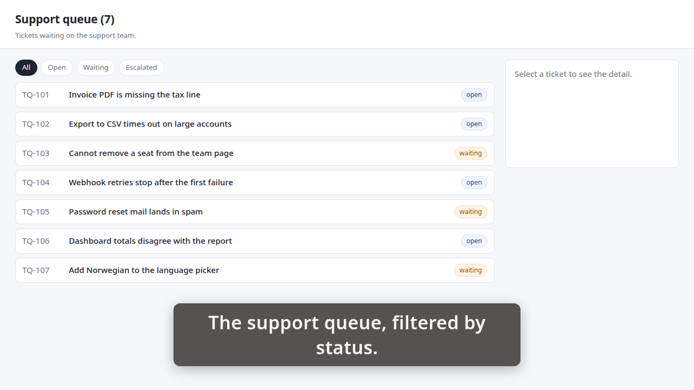
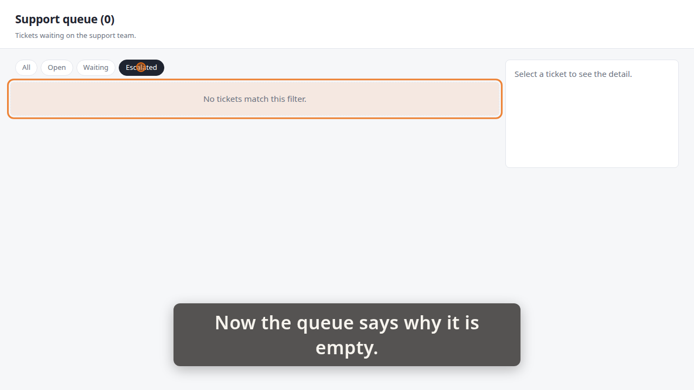
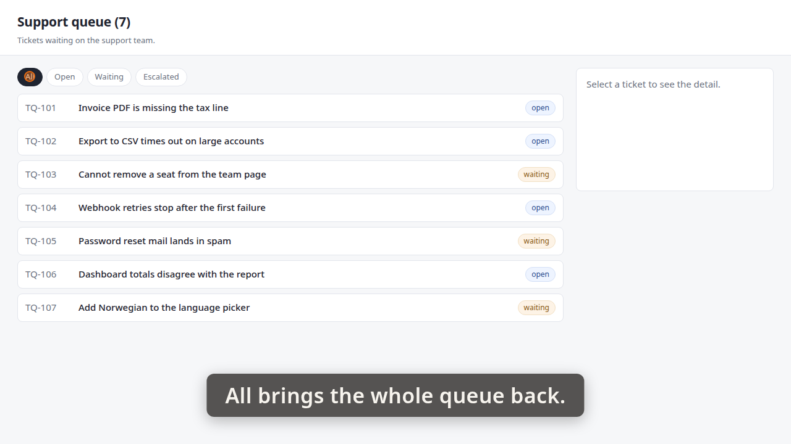

# Demo timeline

`demo.mp4` · Recorder · 32.4s · 28 beats

Written by the demo-video recorder on every clean exit — do not edit it by hand, re-record instead.

| # | start | end | verb | target | caption |
|---:|---:|---:|---|---|---|
| 0 | 0.45 | 1.02 | `goto` | `/` |  |
| 1 | 1.02 | 1.04 | `wait_for` | `.ticket` |  |
| 2 | 1.04 | 3.69 | `caption` |  | The support queue, filtered by status. |
| 3 | 3.69 | 5.22 | `hold` |  | The support queue, filtered by status. |
| 4 | 5.22 | 5.27 | `shot` | `01-queue` | The support queue, filtered by status. |
| 5 | 5.27 | 8.60 | `caption` |  | No ticket in the queue is escalated today. |
| 6 | 8.60 | 8.94 | `spotlight` | `#status-filter` | No ticket in the queue is escalated today. |
| 7 | 8.94 | 10.47 | `hold` |  | No ticket in the queue is escalated today. |
| 8 | 10.47 | 11.06 | `spotlight` |  | No ticket in the queue is escalated today. |
| 9 | 11.06 | 14.08 | `caption` |  | Choosing Escalated used to leave blank space. |
| 10 | 14.08 | 14.99 | `click` | `button[data-status='escalated']` | Choosing Escalated used to leave blank space. |
| 11 | 14.99 | 15.01 | `wait_for` | `.queue-empty` | Choosing Escalated used to leave blank space. |
| 12 | 15.01 | 16.52 | `hold` |  | Choosing Escalated used to leave blank space. |
| 13 | 16.52 | 19.86 | `caption` |  | Now the queue says why it is empty. |
| 14 | 19.86 | 20.19 | `spotlight` | `.queue-empty` | Now the queue says why it is empty. |
| 15 | 20.19 | 21.74 | `hold` |  | Now the queue says why it is empty. |
| 16 | 21.74 | 21.79 | `shot` | `02-empty` | Now the queue says why it is empty. |
| 17 | 21.79 | 22.37 | `spotlight` |  | Now the queue says why it is empty. |
| 18 | 22.37 | 24.70 | `caption` |  | The heading agrees: nothing matched. |
| 19 | 24.70 | 25.04 | `spotlight` | `#queue-heading` | The heading agrees: nothing matched. |
| 20 | 25.04 | 26.56 | `hold` |  | The heading agrees: nothing matched. |
| 21 | 26.56 | 27.15 | `spotlight` |  | The heading agrees: nothing matched. |
| 22 | 27.15 | 29.81 | `caption` |  | All brings the whole queue back. |
| 23 | 29.81 | 30.72 | `click` | `button[data-status='all']` | All brings the whole queue back. |
| 24 | 30.72 | 30.73 | `wait_for` | `.ticket` | All brings the whole queue back. |
| 25 | 30.73 | 32.25 | `hold` |  | All brings the whole queue back. |
| 26 | 32.25 | 32.30 | `shot` | `03-all` | All brings the whole queue back. |
| 27 | 32.30 | 32.61 | `caption` |  |  |

## Stills

### 01-queue — 5.22s

> The support queue, filtered by status.

### 02-empty — 21.74s

> Now the queue says why it is empty.

### 03-all — 32.25s

> All brings the whole queue back.

