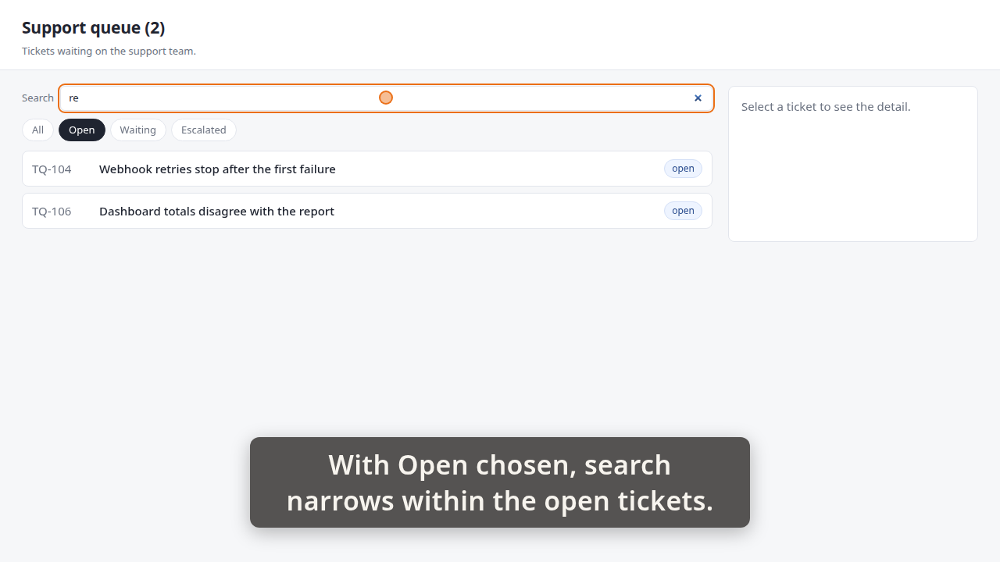
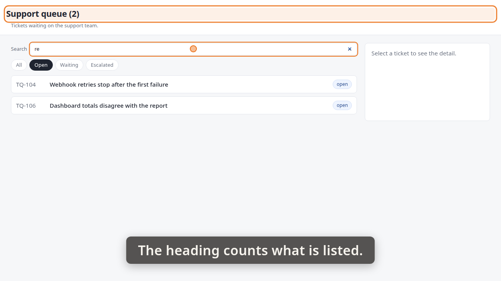
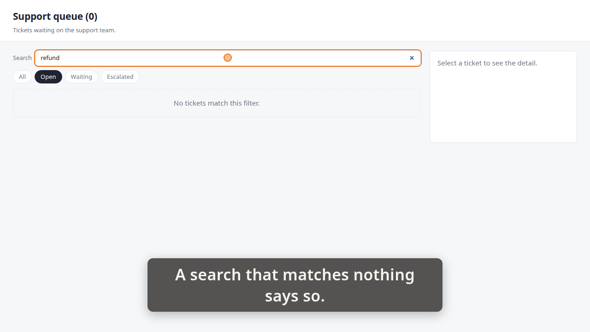
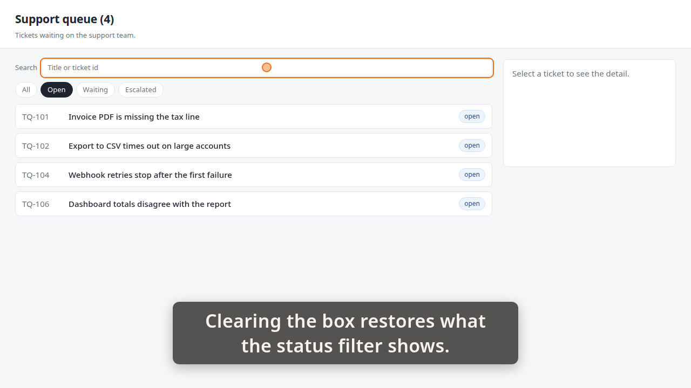

# Demo timeline

`demo.mp4` · Recorder · 50.0s · 43 beats

Written by the demo-video recorder on every clean exit — do not edit it by hand, re-record instead.

## Acceptance criteria

This take was recorded against a ticket. **The table below is what the storyboard *claimed*, not what it proved** — an `ac=` tag is a string its author typed, and whether the frames actually show the criterion is the reviewer's judgement, not this file's.

| criterion | claimed by | at | still |
|---|---|---:|---|
| **AC-1** — A search box above the queue narrows the list as you type, case-insensitively, with no button to press. | beat 2 | 1.08 |  |
|  | beat 5 | 5.97 | `images/01-search-box.png` |
|  | beat 7 | 6.61 |  |
|  | beat 11 | 12.72 | `images/02-invoice.png` |
| **AC-2** — Search and the status filter combine, and the heading count agrees with what is listed. | beat 21 | 24.23 |  |
|  | beat 25 | 30.42 | `images/04-open-and-search.png` |
|  | beat 26 | 30.47 |  |
|  | beat 29 | 34.98 | `images/05-heading.png` |
| **AC-3** — Search matches the requester as well as the title — typing part of a name or address finds that person's tickets. | beat 12 | 12.76 |  |
|  | beat 16 | 20.00 | `images/03-requester.png` |
| **AC-4** — A search matching nothing shows the same 'No tickets match this filter.' line, and clearing the box restores the status filter's list. | beat 31 | 36.02 |  |
|  | beat 36 | 43.19 | `images/06-no-match.png` |
|  | beat 37 | 43.38 |  |
|  | beat 41 | 49.49 | `images/07-restored.png` |

Every one of the 4 criteria has at least one beat claiming it. Whether those beats show what they claim is the reviewer's call.

29 beat(s) claim no criterion. That is ordinary — navigation, waits and captions that set the scene are not demonstrating anything in particular.

| # | start | end | verb | target | caption |
|---:|---:|---:|---|---|---|
| 0 | 0.49 | 1.05 | `goto` | `/` |  |
| 1 | 1.05 | 1.08 | `wait_for` | `.ticket` |  |
| 2 | 1.08 | 4.09 | `caption` |  | A search box sits above the queue. |
| 3 | 4.09 | 4.42 | `spotlight` | `#queue-search` | A search box sits above the queue. |
| 4 | 4.42 | 5.97 | `hold` |  | A search box sits above the queue. |
| 5 | 5.97 | 6.05 | `shot` | `01-search-box` | A search box sits above the queue. |
| 6 | 6.05 | 6.61 | `spotlight` |  | A search box sits above the queue. |
| 7 | 6.61 | 9.95 | `caption` |  | Typing invoice in lower case narrows the list. |
| 8 | 9.95 | 11.20 | `type_into` | `#queue-search` | Typing invoice in lower case narrows the list. |
| 9 | 11.20 | 11.21 | `wait_for` | `.ticket` | Typing invoice in lower case narrows the list. |
| 10 | 11.21 | 12.72 | `hold` |  | Typing invoice in lower case narrows the list. |
| 11 | 12.72 | 12.76 | `shot` | `02-invoice` | Typing invoice in lower case narrows the list. |
| 12 | 12.76 | 16.43 | `caption` |  | Search matches the requester as well as the title. |
| 13 | 16.43 | 17.37 | `click` | `#queue-search` | Search matches the requester as well as the title. |
| 14 | 17.39 | 18.49 | `type_into` | `#queue-search` | Search matches the requester as well as the title. |
| 15 | 18.49 | 20.00 | `hold` |  | Search matches the requester as well as the title. |
| 16 | 20.00 | 20.05 | `shot` | `03-requester` | Search matches the requester as well as the title. |
| 17 | 20.05 | 22.36 | `caption` |  | Clearing the box, choosing Open. |
| 18 | 22.36 | 23.28 | `click` | `#queue-search` | Clearing the box, choosing Open. |
| 19 | 23.29 | 24.21 | `click` | `button[data-status='open']` | Clearing the box, choosing Open. |
| 20 | 24.21 | 24.23 | `wait_for` | `.ticket` | Clearing the box, choosing Open. |
| 21 | 24.23 | 27.89 | `caption` |  | With Open chosen, search narrows within the open tickets. |
| 22 | 27.89 | 28.90 | `type_into` | `#queue-search` | With Open chosen, search narrows within the open tickets. |
| 23 | 28.90 | 28.91 | `wait_for` | `.ticket` | With Open chosen, search narrows within the open tickets. |
| 24 | 28.91 | 30.42 | `hold` |  | With Open chosen, search narrows within the open tickets. |
| 25 | 30.42 | 30.47 | `shot` | `04-open-and-search` | With Open chosen, search narrows within the open tickets. |
| 26 | 30.47 | 33.12 | `caption` |  | The heading counts what is listed. |
| 27 | 33.12 | 33.46 | `spotlight` | `#queue-heading` | The heading counts what is listed. |
| 28 | 33.46 | 34.98 | `hold` |  | The heading counts what is listed. |
| 29 | 34.98 | 35.45 | `shot` | `05-heading` | The heading counts what is listed. |
| 30 | 35.45 | 36.02 | `spotlight` |  | The heading counts what is listed. |
| 31 | 36.02 | 39.55 | `caption` |  | A search that matches nothing says so. |
| 32 | 39.55 | 40.48 | `click` | `#queue-search` | A search that matches nothing says so. |
| 33 | 40.48 | 41.67 | `type_into` | `#queue-search` | A search that matches nothing says so. |
| 34 | 41.67 | 41.68 | `wait_for` | `.queue-empty` | A search that matches nothing says so. |
| 35 | 41.68 | 43.19 | `hold` |  | A search that matches nothing says so. |
| 36 | 43.19 | 43.38 | `shot` | `06-no-match` | A search that matches nothing says so. |
| 37 | 43.38 | 47.05 | `caption` |  | Clearing the box restores what the status filter shows. |
| 38 | 47.05 | 47.96 | `click` | `#queue-search` | Clearing the box restores what the status filter shows. |
| 39 | 47.97 | 47.98 | `wait_for` | `.ticket` | Clearing the box restores what the status filter shows. |
| 40 | 47.98 | 49.49 | `hold` |  | Clearing the box restores what the status filter shows. |
| 41 | 49.49 | 49.54 | `shot` | `07-restored` | Clearing the box restores what the status filter shows. |
| 42 | 49.54 | 49.85 | `caption` |  |  |

## Stills

### 01-search-box — 5.97s

> A search box sits above the queue.

### 02-invoice — 12.72s

> Typing invoice in lower case narrows the list.

### 03-requester — 20.00s

> Search matches the requester as well as the title.

### 04-open-and-search — 30.42s

> With Open chosen, search narrows within the open tickets.

### 05-heading — 34.98s

> The heading counts what is listed.

### 06-no-match — 43.19s

> A search that matches nothing says so.

### 07-restored — 49.49s

> Clearing the box restores what the status filter shows.

