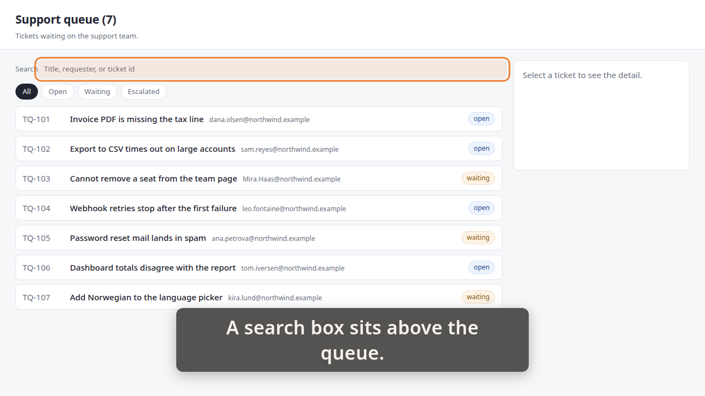
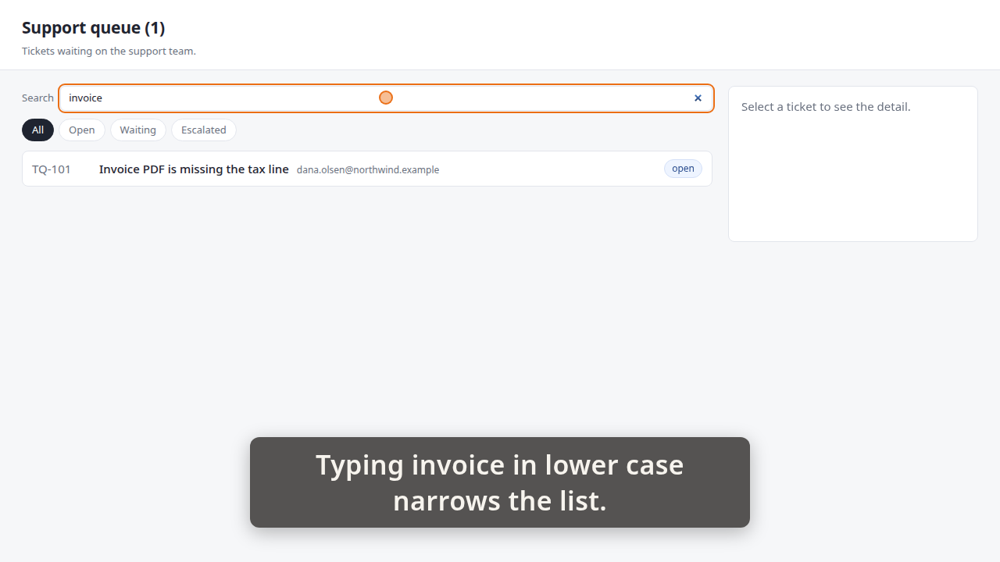
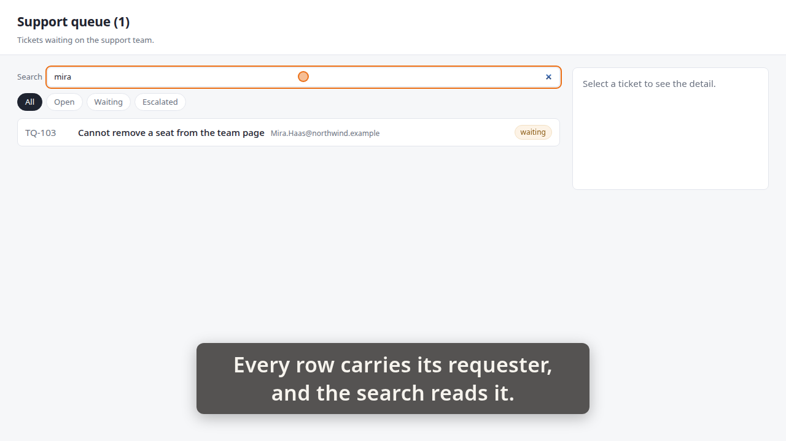
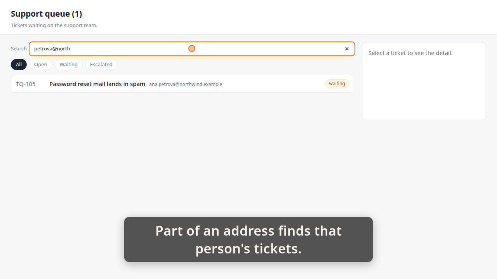
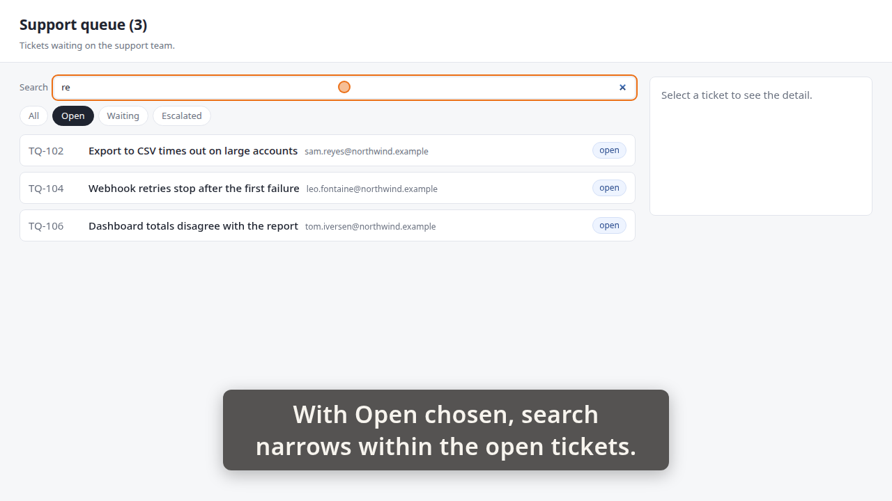
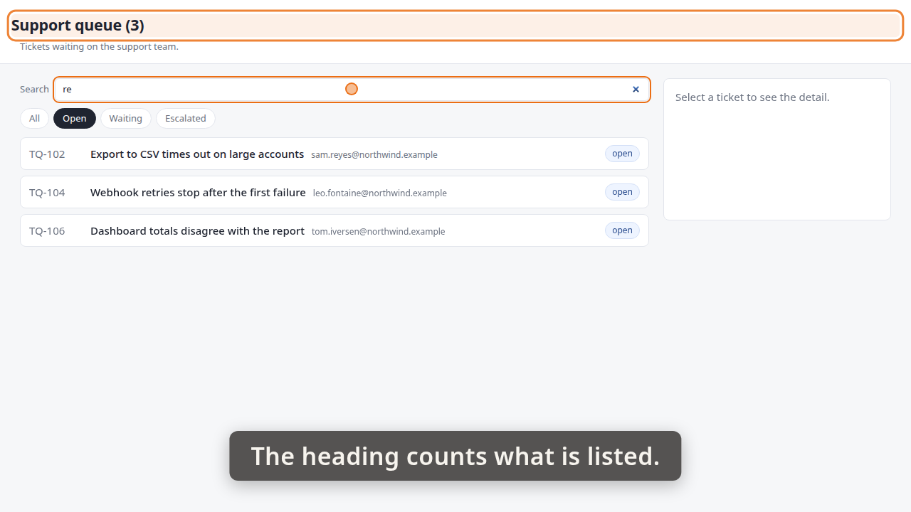
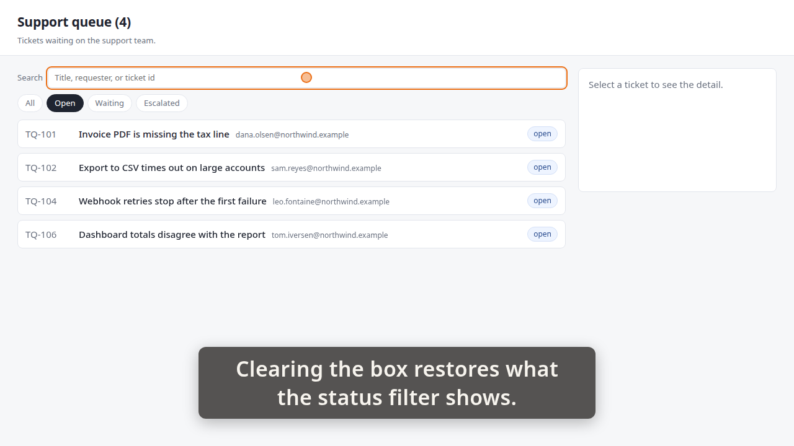

# Demo timeline

`demo.mp4` · Recorder · 57.3s · 50 beats

Written by the demo-video recorder on every clean exit — do not edit it by hand, re-record instead.

## Acceptance criteria

This take was recorded against a ticket. **The table below is what the storyboard *claimed*, not what it proved** — an `ac=` tag is a string its author typed, and whether the frames actually show the criterion is the reviewer's judgement, not this file's.

| criterion | claimed by | at | still |
|---|---|---:|---|
| **AC-1** — A search box above the queue narrows the list as you type, case-insensitively, with no button to press. | beat 2 | 1.02 |  |
|  | beat 5 | 5.89 | `images/01-search-box.png` |
|  | beat 7 | 6.54 |  |
|  | beat 11 | 12.62 | `images/02-invoice.png` |
| **AC-2** — Search and the status filter combine, and the heading count agrees with what is listed. | beat 28 | 31.76 |  |
|  | beat 32 | 37.95 | `images/05-open-and-search.png` |
|  | beat 33 | 38.02 |  |
|  | beat 36 | 42.52 | `images/06-heading.png` |
| **AC-3** — Search matches the requester as well as the title — typing part of a name or address finds that person's tickets. | beat 12 | 12.66 |  |
|  | beat 17 | 20.22 | `images/03-requester.png` |
|  | beat 18 | 20.26 |  |
|  | beat 23 | 27.52 | `images/04-address.png` |
| **AC-4** — A search matching nothing shows the same 'No tickets match this filter.' line, and clearing the box restores the status filter's list. | beat 38 | 43.17 |  |
|  | beat 43 | 49.80 | `images/07-no-match.png` |
|  | beat 44 | 49.89 |  |
|  | beat 48 | 56.06 | `images/08-restored.png` |

Every one of the 4 criteria has at least one beat claiming it. Whether those beats show what they claim is the reviewer's call.

34 beat(s) claim no criterion. That is ordinary — navigation, waits and captions that set the scene are not demonstrating anything in particular.

| # | start | end | verb | target | caption |
|---:|---:|---:|---|---|---|
| 0 | 0.44 | 1.00 | `goto` | `/` |  |
| 1 | 1.00 | 1.02 | `wait_for` | `.ticket` |  |
| 2 | 1.02 | 4.03 | `caption` |  | A search box sits above the queue. |
| 3 | 4.03 | 4.37 | `spotlight` | `#queue-search` | A search box sits above the queue. |
| 4 | 4.37 | 5.89 | `hold` |  | A search box sits above the queue. |
| 5 | 5.89 | 5.97 | `shot` | `01-search-box` | A search box sits above the queue. |
| 6 | 5.97 | 6.54 | `spotlight` |  | A search box sits above the queue. |
| 7 | 6.54 | 9.87 | `caption` |  | Typing invoice in lower case narrows the list. |
| 8 | 9.87 | 11.10 | `type_into` | `#queue-search` | Typing invoice in lower case narrows the list. |
| 9 | 11.10 | 11.11 | `wait_for` | `.ticket` | Typing invoice in lower case narrows the list. |
| 10 | 11.11 | 12.62 | `hold` |  | Typing invoice in lower case narrows the list. |
| 11 | 12.62 | 12.66 | `shot` | `02-invoice` | Typing invoice in lower case narrows the list. |
| 12 | 12.66 | 16.67 | `caption` |  | Every row carries its requester, and the search reads it. |
| 13 | 16.67 | 17.59 | `click` | `#queue-search` | Every row carries its requester, and the search reads it. |
| 14 | 17.60 | 18.69 | `type_into` | `#queue-search` | Every row carries its requester, and the search reads it. |
| 15 | 18.69 | 18.71 | `wait_for` | `.ticket[data-id='TQ-103'] .ticket-requester` | Every row carries its requester, and the search reads it. |
| 16 | 18.71 | 20.22 | `hold` |  | Every row carries its requester, and the search reads it. |
| 17 | 20.22 | 20.26 | `shot` | `03-requester` | Every row carries its requester, and the search reads it. |
| 18 | 20.26 | 23.59 | `caption` |  | Part of an address finds that person's tickets. |
| 19 | 23.59 | 24.50 | `click` | `#queue-search` | Part of an address finds that person's tickets. |
| 20 | 24.51 | 26.00 | `type_into` | `#queue-search` | Part of an address finds that person's tickets. |
| 21 | 26.00 | 26.01 | `wait_for` | `.ticket[data-id='TQ-105'] .ticket-requester` | Part of an address finds that person's tickets. |
| 22 | 26.01 | 27.52 | `hold` |  | Part of an address finds that person's tickets. |
| 23 | 27.52 | 27.57 | `shot` | `04-address` | Part of an address finds that person's tickets. |
| 24 | 27.57 | 29.88 | `caption` |  | Clearing the box, choosing Open. |
| 25 | 29.88 | 30.81 | `click` | `#queue-search` | Clearing the box, choosing Open. |
| 26 | 30.81 | 31.74 | `click` | `button[data-status='open']` | Clearing the box, choosing Open. |
| 27 | 31.74 | 31.76 | `wait_for` | `.ticket` | Clearing the box, choosing Open. |
| 28 | 31.76 | 35.43 | `caption` |  | With Open chosen, search narrows within the open tickets. |
| 29 | 35.43 | 36.43 | `type_into` | `#queue-search` | With Open chosen, search narrows within the open tickets. |
| 30 | 36.43 | 36.44 | `wait_for` | `.ticket` | With Open chosen, search narrows within the open tickets. |
| 31 | 36.44 | 37.95 | `hold` |  | With Open chosen, search narrows within the open tickets. |
| 32 | 37.95 | 38.02 | `shot` | `05-open-and-search` | With Open chosen, search narrows within the open tickets. |
| 33 | 38.02 | 40.67 | `caption` |  | The heading counts what is listed. |
| 34 | 40.67 | 41.00 | `spotlight` | `#queue-heading` | The heading counts what is listed. |
| 35 | 41.00 | 42.52 | `hold` |  | The heading counts what is listed. |
| 36 | 42.52 | 42.60 | `shot` | `06-heading` | The heading counts what is listed. |
| 37 | 42.60 | 43.17 | `spotlight` |  | The heading counts what is listed. |
| 38 | 43.17 | 46.16 | `caption` |  | A search that matches nothing says so. |
| 39 | 46.16 | 47.07 | `click` | `#queue-search` | A search that matches nothing says so. |
| 40 | 47.08 | 48.26 | `type_into` | `#queue-search` | A search that matches nothing says so. |
| 41 | 48.26 | 48.27 | `wait_for` | `.queue-empty` | A search that matches nothing says so. |
| 42 | 48.27 | 49.80 | `hold` |  | A search that matches nothing says so. |
| 43 | 49.80 | 49.89 | `shot` | `07-no-match` | A search that matches nothing says so. |
| 44 | 49.89 | 53.58 | `caption` |  | Clearing the box restores what the status filter shows. |
| 45 | 53.58 | 54.52 | `click` | `#queue-search` | Clearing the box restores what the status filter shows. |
| 46 | 54.53 | 54.55 | `wait_for` | `.ticket` | Clearing the box restores what the status filter shows. |
| 47 | 54.55 | 56.06 | `hold` |  | Clearing the box restores what the status filter shows. |
| 48 | 56.06 | 56.13 | `shot` | `08-restored` | Clearing the box restores what the status filter shows. |
| 49 | 56.13 | 56.44 | `caption` |  |  |

## Stills

### 01-search-box — 5.89s

> A search box sits above the queue.

### 02-invoice — 12.62s

> Typing invoice in lower case narrows the list.

### 03-requester — 20.22s

> Every row carries its requester, and the search reads it.

### 04-address — 27.52s

> Part of an address finds that person's tickets.

### 05-open-and-search — 37.95s

> With Open chosen, search narrows within the open tickets.

### 06-heading — 42.52s

> The heading counts what is listed.

### 07-no-match — 49.80s

> A search that matches nothing says so.

### 08-restored — 56.06s

> Clearing the box restores what the status filter shows.

