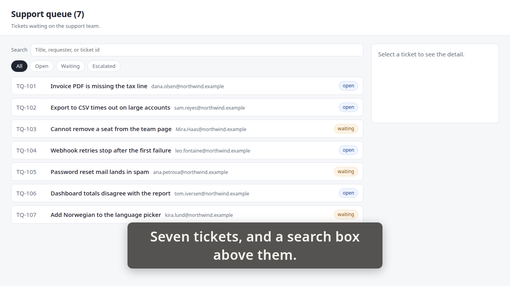
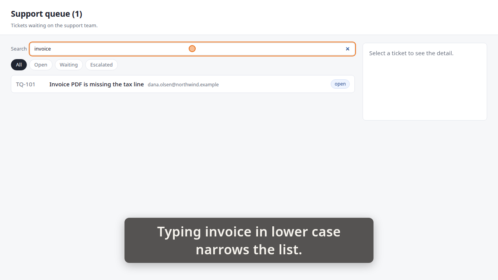
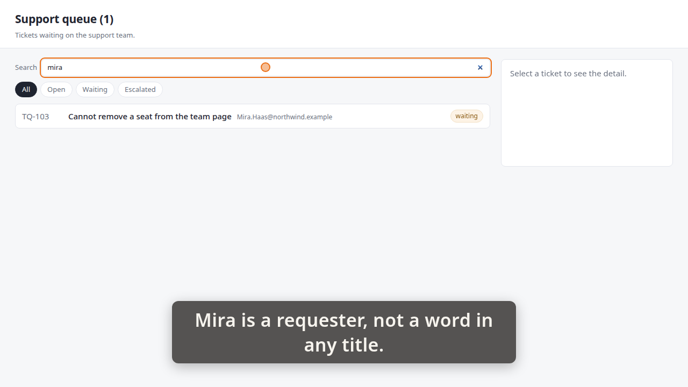
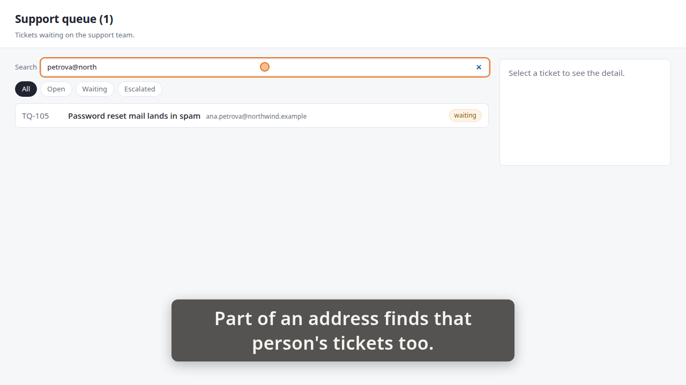

# Demo timeline

`demo.mp4` · Recorder · 56.8s · 35 beats

Written by the demo-video recorder on every clean exit — do not edit it by hand, re-record instead.

## Acceptance criteria

This take was recorded against a ticket. **The table below is what the storyboard *claimed*, not what it proved** — an `ac=` tag is a string its author typed, and whether the frames actually show the criterion is the reviewer's judgement, not this file's.

| criterion | claimed by | at | still |
|---|---|---:|---|
| **AC-1** — A search box above the queue narrows the list as you type, case-insensitively, with no button to press. | beat 4 | 5.87 | `images/01-queue.png` |
|  | beat 6 | 6.25 |  |
|  | beat 8 | 13.59 |  |
|  | beat 12 | 19.67 | `images/02-invoice.png` |
|  | beat 13 | 19.72 |  |
| **AC-3** — Search matches the requester as well as the title — typing part of a name or address finds that person's tickets. | beat 18 | 26.11 |  |
|  | beat 20 | 34.46 |  |
|  | beat 25 | 42.03 | `images/03-requester.png` |
|  | beat 26 | 42.07 |  |
|  | beat 31 | 49.68 | `images/04-address.png` |

Every one of the 2 criteria has at least one beat claiming it. Whether those beats show what they claim is the reviewer's call.

25 beat(s) claim no criterion. That is ordinary — navigation, waits and captions that set the scene are not demonstrating anything in particular.

| # | start | end | verb | target | caption |
|---:|---:|---:|---|---|---|
| 0 | 0.43 | 1.00 | `goto` | `/` |  |
| 1 | 1.00 | 1.02 | `wait_for` | `.ticket` |  |
| 2 | 1.02 | 4.36 | `caption` |  | Seven tickets, and a search box above them. |
| 3 | 4.36 | 5.87 | `hold` |  | Seven tickets, and a search box above them. |
| 4 | 5.87 | 5.93 | `shot` | `01-queue` | Seven tickets, and a search box above them. |
| 5 | 5.93 | 6.25 | `caption` |  |  |
| 6 | 6.25 | 12.98 | `criterion` | `AC-1` | A search box above the queue narrows the list as you type, case-insensitively, with no button to press. |
| 7 | 12.98 | 13.59 | `interlude` | `card` |  |
| 8 | 13.59 | 16.93 | `caption` |  | Typing invoice in lower case narrows the list. |
| 9 | 16.93 | 18.15 | `type_into` | `#queue-search` | Typing invoice in lower case narrows the list. |
| 10 | 18.15 | 18.16 | `wait_for` | `.ticket` | Typing invoice in lower case narrows the list. |
| 11 | 18.16 | 19.67 | `hold` |  | Typing invoice in lower case narrows the list. |
| 12 | 19.67 | 19.72 | `shot` | `02-invoice` | Typing invoice in lower case narrows the list. |
| 13 | 19.72 | 23.39 | `caption` |  | No button was pressed, and the case never matched. |
| 14 | 23.39 | 23.72 | `spotlight` | `#queue-search` | No button was pressed, and the case never matched. |
| 15 | 23.72 | 25.24 | `hold` |  | No button was pressed, and the case never matched. |
| 16 | 25.24 | 25.79 | `spotlight` |  | No button was pressed, and the case never matched. |
| 17 | 25.79 | 26.11 | `caption` |  |  |
| 18 | 26.11 | 33.85 | `criterion` | `AC-3` | Search matches the requester as well as the title — typing part of a name or address finds that person's tickets. |
| 19 | 33.85 | 34.46 | `interlude` | `card` |  |
| 20 | 34.46 | 38.47 | `caption` |  | Mira is a requester, not a word in any title. |
| 21 | 38.47 | 39.38 | `click` | `#queue-search` | Mira is a requester, not a word in any title. |
| 22 | 39.39 | 40.50 | `type_into` | `#queue-search` | Mira is a requester, not a word in any title. |
| 23 | 40.50 | 40.52 | `wait_for` | `.ticket[data-id='TQ-103'] .ticket-requester` | Mira is a requester, not a word in any title. |
| 24 | 40.52 | 42.03 | `hold` |  | Mira is a requester, not a word in any title. |
| 25 | 42.03 | 42.07 | `shot` | `03-requester` | Mira is a requester, not a word in any title. |
| 26 | 42.07 | 45.74 | `caption` |  | Part of an address finds that person's tickets too. |
| 27 | 45.74 | 46.66 | `click` | `#queue-search` | Part of an address finds that person's tickets too. |
| 28 | 46.67 | 48.16 | `type_into` | `#queue-search` | Part of an address finds that person's tickets too. |
| 29 | 48.16 | 48.17 | `wait_for` | `.ticket[data-id='TQ-105'] .ticket-requester` | Part of an address finds that person's tickets too. |
| 30 | 48.17 | 49.68 | `hold` |  | Part of an address finds that person's tickets too. |
| 31 | 49.68 | 49.72 | `shot` | `04-address` | Part of an address finds that person's tickets too. |
| 32 | 49.72 | 54.08 | `caption` |  | Title, then requester — each after the sentence asking for it. |
| 33 | 54.08 | 55.59 | `hold` |  | Title, then requester — each after the sentence asking for it. |
| 34 | 55.59 | 55.90 | `caption` |  |  |

## Stills

### 01-queue — 5.87s

> Seven tickets, and a search box above them.

### 02-invoice — 19.67s

> Typing invoice in lower case narrows the list.

### 03-requester — 42.03s

> Mira is a requester, not a word in any title.

### 04-address — 49.68s

> Part of an address finds that person's tickets too.

