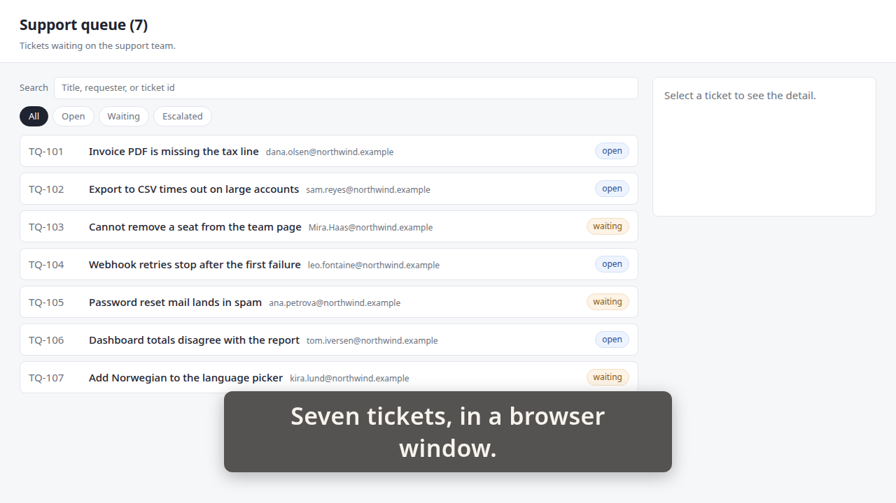
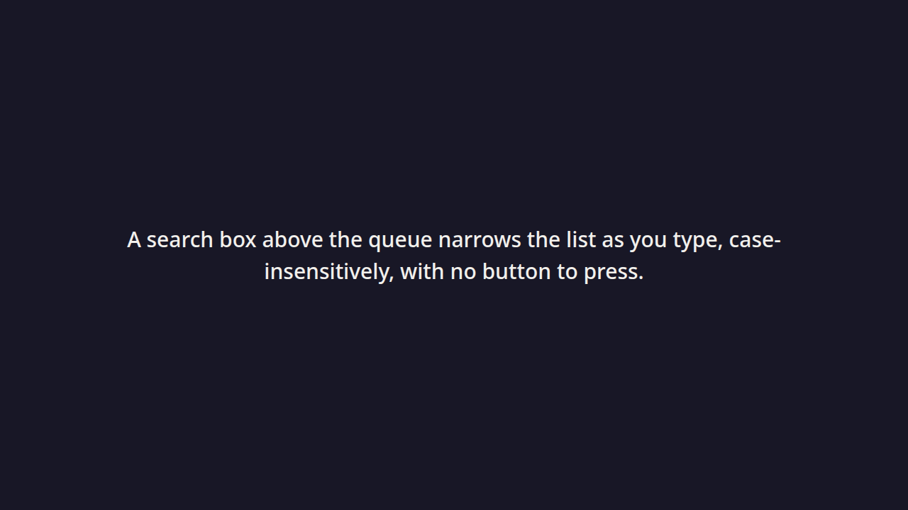
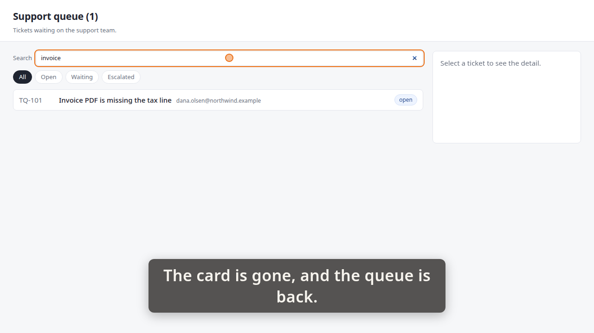
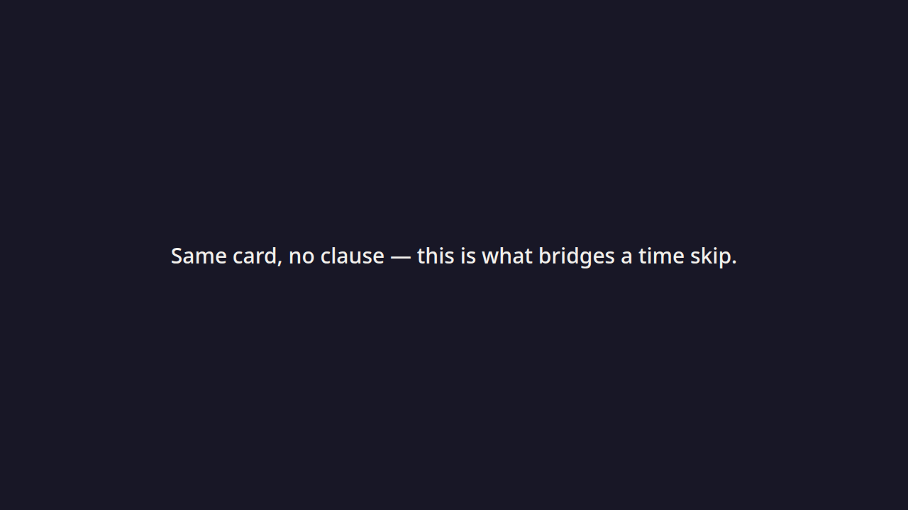

# Demo timeline

`demo.mp4` · Recorder · 29.6s · 21 beats

Written by the demo-video recorder on every clean exit — do not edit it by hand, re-record instead.

## Acceptance criteria

This take was recorded against a ticket. **The table below is what the storyboard *claimed*, not what it proved** — an `ac=` tag is a string its author typed, and whether the frames actually show the criterion is the reviewer's judgement, not this file's.

| criterion | claimed by | at | still |
|---|---|---:|---|
| **AC-1** — A search box above the queue narrows the list as you type, case-insensitively, with no button to press. | beat 4 | 5.15 | `images/01-queue.png` |
|  | beat 6 | 5.52 |  |
|  | beat 7 | 12.25 | `images/02-criterion-card.png` |
|  | beat 13 | 19.33 | `images/03-invoice.png` |

Every one of the 1 criteria has at least one beat claiming it. Whether those beats show what they claim is the reviewer's call.

17 beat(s) claim no criterion. That is ordinary — navigation, waits and captions that set the scene are not demonstrating anything in particular.

**The host's wall clock stepped 1 time(s) while this was recorded** (-0.63s in total). The times below are `time.monotonic()`; the recording is on that wall clock, so an instant this table puts at `t` sits at `t` plus the steps its own capture recorded before `t` — not at `t`, and not at `t` plus the total above, which is the correction for no single row. `timeline.json`'s `capture_clock` carries every step and the capture it was measured in; `frames/frames.md` says whether the review frames were cut with it applied.

| # | start | end | verb | target | caption |
|---:|---:|---:|---|---|---|
| 0 | 0.38 | 0.95 | `goto` | `/` |  |
| 1 | 0.95 | 0.98 | `wait_for` | `.ticket` |  |
| 2 | 0.98 | 3.64 | `caption` |  | Seven tickets, in a browser window. |
| 3 | 3.64 | 5.15 | `hold` |  | Seven tickets, in a browser window. |
| 4 | 5.15 | 5.21 | `shot` | `01-queue` | Seven tickets, in a browser window. |
| 5 | 5.21 | 5.52 | `caption` |  |  |
| 6 | 5.52 | 12.25 | `criterion` | `AC-1` | A search box above the queue narrows the list as you type, case-insensitively, with no button to press. |
| 7 | 12.25 | 12.30 | `shot` | `02-criterion-card` |  |
| 8 | 12.30 | 12.91 | `interlude` | `card` |  |
| 9 | 12.91 | 16.58 | `caption` |  | The card is gone, and the queue is back. |
| 10 | 16.58 | 17.81 | `type_into` | `#queue-search` | The card is gone, and the queue is back. |
| 11 | 17.81 | 17.82 | `wait_for` | `.ticket` | The card is gone, and the queue is back. |
| 12 | 17.82 | 19.33 | `hold` |  | The card is gone, and the queue is back. |
| 13 | 19.33 | 19.39 | `shot` | `03-invoice` | The card is gone, and the queue is back. |
| 14 | 19.39 | 19.70 | `caption` |  |  |
| 15 | 19.70 | 22.51 | `interlude` | `card` | Same card, no clause — this is what bridges a time skip. |
| 16 | 22.51 | 22.55 | `shot` | `04-interlude-card` |  |
| 17 | 22.55 | 23.16 | `interlude` | `card` |  |
| 18 | 23.16 | 27.51 | `caption` |  | Queue, card, queue again — the card sits over the app. |
| 19 | 27.51 | 29.02 | `hold` |  | Queue, card, queue again — the card sits over the app. |
| 20 | 29.02 | 29.33 | `caption` |  |  |

## Stills

### 01-queue — 5.15s

> Seven tickets, in a browser window.

### 02-criterion-card — 12.25s

### 03-invoice — 19.33s

> The card is gone, and the queue is back.

### 04-interlude-card — 22.51s

