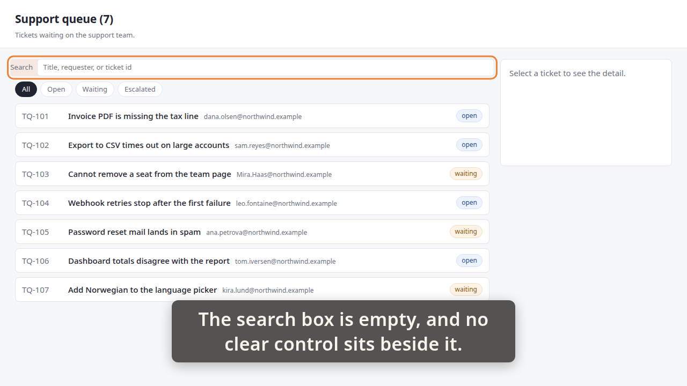
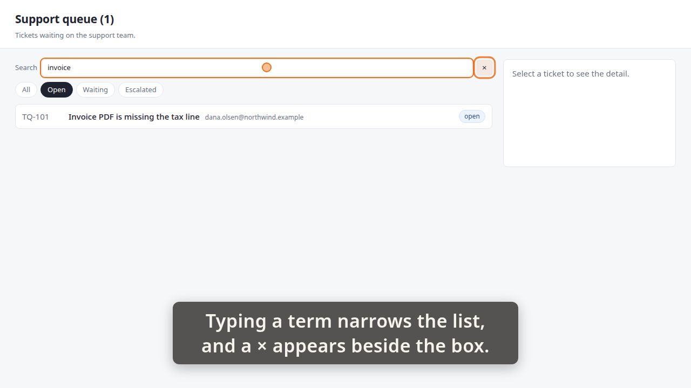
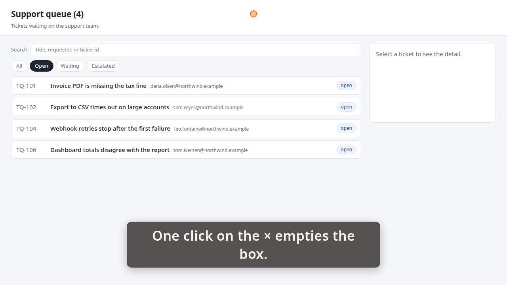
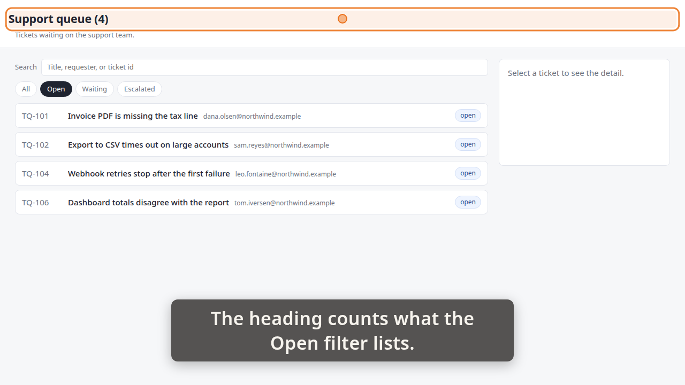

# Demo timeline

`demo.mp4` · Recorder · 33.8s · 33 beats

Written by the demo-video recorder on every clean exit — do not edit it by hand, re-record instead.

Recorded against **rogvid/skills#336**, as the storyboard names it. The recorder never fetched it: nothing here has compared anything in this file with what that ticket says.

## Acceptance criteria

This take was recorded against a ticket. **The table below is what the storyboard *claimed*, not what it proved** — an `ac=` tag is a string its author typed, and whether the frames actually show the criterion is the reviewer's judgement, not this file's.

| criterion | claimed by | at | still |
|---|---|---:|---|
| **AC-1** — While the search box holds text, a clear control ("×") is visible beside it. While the box is empty, the control is absent. | beat 2 | 1.10 |  |
|  | beat 5 | 7.66 | `images/01-empty-box.png` |
|  | beat 10 | 12.59 |  |
|  | beat 16 | 20.72 | `images/02-control-appears.png` |
| **AC-2** — Activating the clear control empties the box and restores the list to what the active status filter alone would show, with the heading count agreeing. | beat 18 | 21.36 |  |
|  | beat 26 | 27.68 | `images/03-restored.png` |
|  | beat 27 | 27.74 |  |
|  | beat 30 | 32.93 | `images/04-heading.png` |

Every one of the 2 criteria has at least one beat claiming it. Whether those beats show what they claim is the reviewer's call.

25 beat(s) claim no criterion. That is ordinary — navigation, waits and captions that set the scene are not demonstrating anything in particular.

**The host's wall clock stepped 1 time(s) while this was recorded** (-1.02s in total). The times below are `time.monotonic()`; the recording is on that wall clock, so an instant this table puts at `t` sits at `t` plus the steps its own capture recorded before `t` — not at `t`, and not at `t` plus the total above, which is the correction for no single row. `timeline.json`'s `capture_clock` carries every step and the capture it was measured in; `frames/frames.md` says whether the review frames were cut with it applied.

| # | start | end | verb | target | caption |
|---:|---:|---:|---|---|---|
| 0 | 0.50 | 1.07 | `goto` | `/` |  |
| 1 | 1.07 | 1.10 | `wait_for` | `.ticket` |  |
| 2 | 1.10 | 5.80 | `caption` |  | The search box is empty, and no clear control sits beside it. |
| 3 | 5.80 | 6.13 | `spotlight` | `.queue-search` | The search box is empty, and no clear control sits beside it. |
| 4 | 6.14 | 7.66 | `hold` |  | The search box is empty, and no clear control sits beside it. |
| 5 | 7.66 | 7.75 | `shot` | `01-empty-box` | The search box is empty, and no clear control sits beside it. |
| 6 | 7.75 | 8.33 | `spotlight` |  | The search box is empty, and no clear control sits beside it. |
| 7 | 8.33 | 11.66 | `caption` |  | Choosing Open, so a status filter is active. |
| 8 | 11.66 | 12.58 | `click` | `button[data-status='open']` | Choosing Open, so a status filter is active. |
| 9 | 12.58 | 12.59 | `wait_for` | `.ticket` | Choosing Open, so a status filter is active. |
| 10 | 12.59 | 17.63 | `caption` |  | Typing a term narrows the list, and a × appears beside the box. |
| 11 | 17.63 | 18.85 | `type_into` | `#queue-search` | Typing a term narrows the list, and a × appears beside the box. |
| 12 | 18.85 | 18.86 | `wait_for` | `.ticket` | Typing a term narrows the list, and a × appears beside the box. |
| 13 | 18.86 | 18.88 | `wait_for` | `#clear-search` | Typing a term narrows the list, and a × appears beside the box. |
| 14 | 18.88 | 19.20 | `spotlight` | `#clear-search` | Typing a term narrows the list, and a × appears beside the box. |
| 15 | 19.20 | 20.72 | `hold` |  | Typing a term narrows the list, and a × appears beside the box. |
| 16 | 20.72 | 20.80 | `shot` | `02-control-appears` | Typing a term narrows the list, and a × appears beside the box. |
| 17 | 20.80 | 21.36 | `spotlight` |  | Typing a term narrows the list, and a × appears beside the box. |
| 18 | 21.36 | 24.69 | `caption` |  | One click on the × empties the box. |
| 19 | 24.69 | 25.61 | `click` | `#clear-search` | One click on the × empties the box. |
| 20 | 25.62 | 25.64 | `wait_for` | `.ticket[data-id='TQ-101']` | One click on the × empties the box. |
| 21 | 25.64 | 25.65 | `wait_for` | `.ticket[data-id='TQ-102']` | One click on the × empties the box. |
| 22 | 25.65 | 25.67 | `wait_for` | `.ticket[data-id='TQ-104']` | One click on the × empties the box. |
| 23 | 25.67 | 25.68 | `wait_for` | `.ticket[data-id='TQ-106']` | One click on the × empties the box. |
| 24 | 25.68 | 26.18 | `move_to` | `#queue-heading` | One click on the × empties the box. |
| 25 | 26.18 | 27.68 | `hold` |  | One click on the × empties the box. |
| 26 | 27.68 | 27.74 | `shot` | `03-restored` | One click on the × empties the box. |
| 27 | 27.74 | 31.07 | `caption` |  | The heading counts what the Open filter lists. |
| 28 | 31.07 | 31.41 | `spotlight` | `#queue-heading` | The heading counts what the Open filter lists. |
| 29 | 31.41 | 32.93 | `hold` |  | The heading counts what the Open filter lists. |
| 30 | 32.93 | 33.00 | `shot` | `04-heading` | The heading counts what the Open filter lists. |
| 31 | 33.00 | 33.57 | `spotlight` |  | The heading counts what the Open filter lists. |
| 32 | 33.57 | 33.88 | `caption` |  |  |

## Stills

### 01-empty-box — 7.66s

> The search box is empty, and no clear control sits beside it.

### 02-control-appears — 20.72s

> Typing a term narrows the list, and a × appears beside the box.

### 03-restored — 27.68s

> One click on the × empties the box.

### 04-heading — 32.93s

> The heading counts what the Open filter lists.

