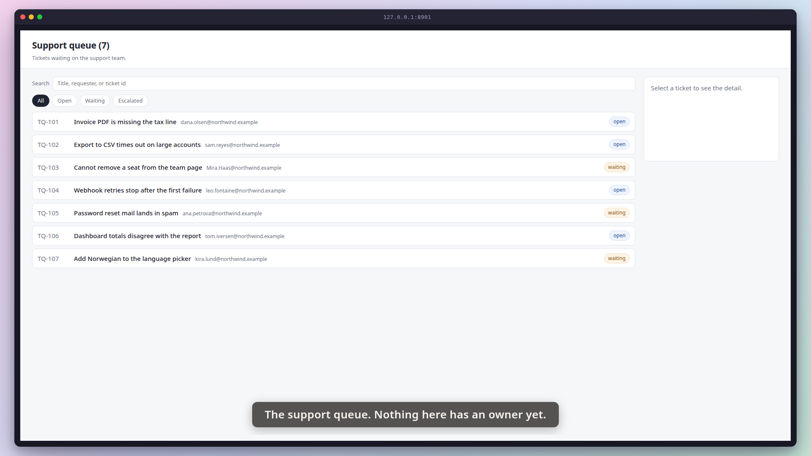
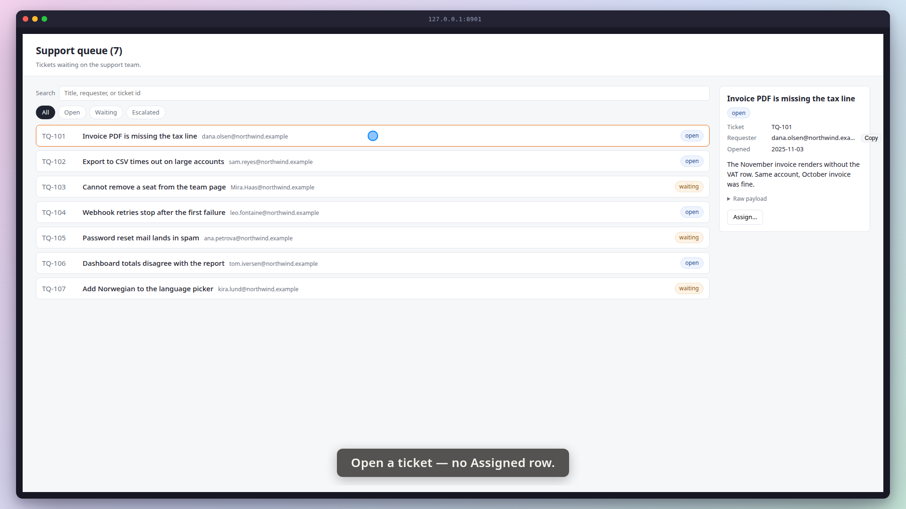
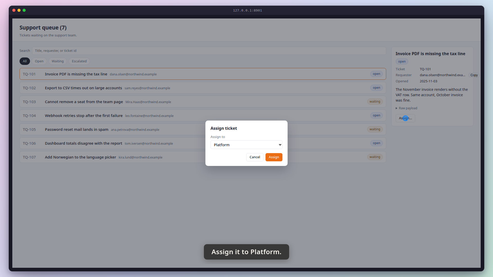
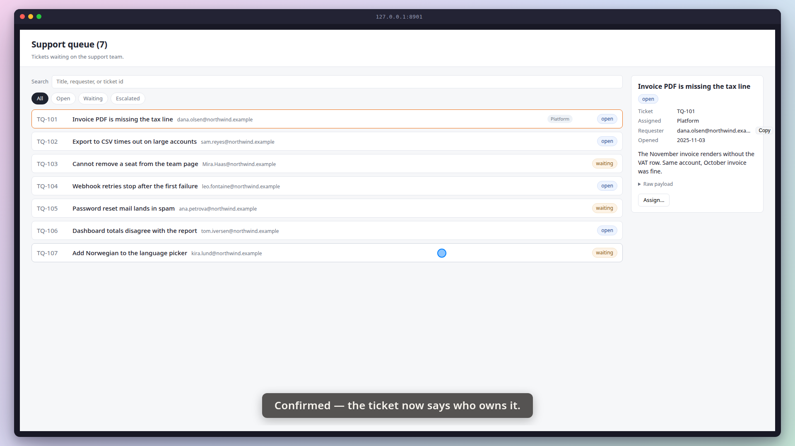
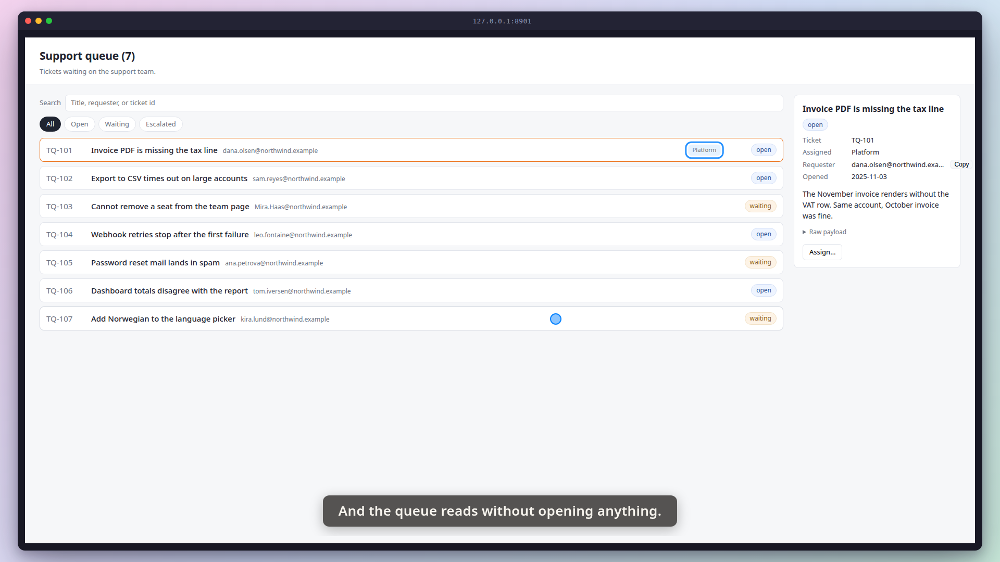
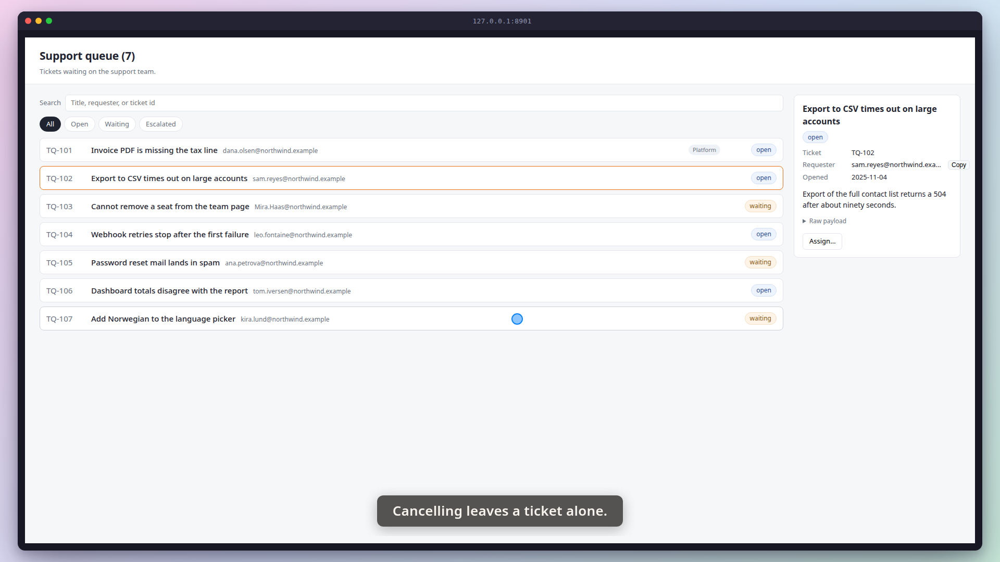

# Demo timeline

`demo.mp4` · Recorder · 19.8s · 30 beats

Written by the demo-video recorder on every clean exit — do not edit it by hand, re-record instead.

Recorded against **rogvid/skills#413**, as the storyboard names it. The recorder never fetched it: nothing here has compared anything in this file with what that ticket says.

## Acceptance criteria

This take was recorded against a ticket. **The table below is what the storyboard *claimed*, not what it proved** — an `ac=` tag is a string its author typed, and whether the frames actually show the criterion is the reviewer's judgement, not this file's.

| criterion | claimed by | at | still |
|---|---|---:|---|
| **AC-1** — Confirming the assign dialog sets the ticket's assignee to the team chosen in the dropdown. | beat 13 | 9.56 |  |
|  | beat 16 | 11.32 | `images/04-assigned.png` |
| **AC-2** — The detail pane shows an Assigned row for a ticket that has an assignee, and no such row for one that does not. | beat 4 | 3.65 |  |
|  | beat 7 | 5.73 | `images/02-before.png` |
| **AC-3** — The queue row shows the assignee, so the queue can be read without opening every ticket. | beat 17 | 12.02 |  |
|  | beat 20 | 12.89 | `images/05-queue-chip.png` |
| **AC-4** — Cancelling the dialog leaves the ticket unassigned. | beat 22 | 14.48 |  |
|  | beat 29 | 20.44 | `images/06-cancelled.png` |

Every one of the 4 criteria has at least one beat claiming it. Whether those beats show what they claim is the reviewer's call.

22 beat(s) claim no criterion. That is ordinary — navigation, waits and captions that set the scene are not demonstrating anything in particular.

**The host's wall clock stepped 1 time(s) while this was recorded** (-1.78s in total). The times below are `time.monotonic()`; the recording is on that wall clock, so an instant this table puts at `t` sits at `t` plus the steps its own capture recorded before `t` — not at `t`, and not at `t` plus the total above, which is the correction for no single row. `timeline.json`'s `capture_clock` carries every step and the capture it was measured in; `frames/frames.md` says whether the review frames were cut with it applied.

**The 6 spoken line(s) were mixed where the host's stepped clock puts them in the video**, not at the beat-log offsets in the table below: each line's `at` in `timeline.json`'s `narration` is its `t` plus the steps its own capture recorded before that instant. Without it the voice would trail the caption by the size of the step for the rest of the take (issue #226).

| # | start | end | verb | target | caption |
|---:|---:|---:|---|---|---|
| 0 | 0.11 | 0.70 | `goto` | `/` |  |
| 1 | 0.70 | 0.76 | `wait_for` | `.ticket` |  |
| 2 | 0.76 | 1.26 | `caption` |  | The support queue. Nothing here has an owner yet. |
| 3 | 1.26 | 1.39 | `shot` | `01-queue` | The support queue. Nothing here has an owner yet. |
| 4 | 3.65 | 4.13 | `caption` |  | Open a ticket — no Assigned row. |
| 5 | 4.13 | 5.69 | `click` | `.ticket[data-id='TQ-101']` | Open a ticket — no Assigned row. |
| 6 | 5.69 | 5.73 | `wait_for` | `#detail dl` | Open a ticket — no Assigned row. |
| 7 | 5.73 | 5.88 | `shot` | `02-before` | Open a ticket — no Assigned row. |
| 8 | 5.88 | 6.37 | `caption` |  | Assign it to Platform. |
| 9 | 6.37 | 7.89 | `click` | `#open-assign` | Assign it to Platform. |
| 10 | 7.89 | 7.92 | `wait_for` | `#assign-modal .modal-card` | Assign it to Platform. |
| 11 | 7.93 | 9.44 | `hold` |  | Assign it to Platform. |
| 12 | 9.44 | 9.56 | `shot` | `03-dialog` | Assign it to Platform. |
| 13 | 9.56 | 10.07 | `caption` |  | Confirmed — the ticket now says who owns it. |
| 14 | 10.07 | 11.27 | `click` | `#assign-confirm` | Confirmed — the ticket now says who owns it. |
| 15 | 11.27 | 11.32 | `wait_for` | `#detail .assignee:has-text('Platform')` | Confirmed — the ticket now says who owns it. |
| 16 | 11.32 | 11.46 | `shot` | `04-assigned` | Confirmed — the ticket now says who owns it. |
| 17 | 12.02 | 12.50 | `caption` |  | And the queue reads without opening anything. |
| 18 | 12.50 | 12.86 | `spotlight` | `.ticket[data-id='TQ-101'] .ticket-assignee` | And the queue reads without opening anything. |
| 19 | 12.86 | 12.89 | `wait_for` | `.ticket[data-id='TQ-101'] .ticket-assignee:has-text('Platform')` | And the queue reads without opening anything. |
| 20 | 12.89 | 13.05 | `shot` | `05-queue-chip` | And the queue reads without opening anything. |
| 21 | 13.05 | 13.63 | `spotlight` |  | And the queue reads without opening anything. |
| 22 | 14.48 | 14.96 | `caption` |  | Cancelling leaves a ticket alone. |
| 23 | 14.96 | 15.99 | `click` | `.ticket[data-id='TQ-102']` | Cancelling leaves a ticket alone. |
| 24 | 15.99 | 17.52 | `click` | `#open-assign` | Cancelling leaves a ticket alone. |
| 25 | 17.52 | 17.57 | `wait_for` | `#assign-modal .modal-card` | Cancelling leaves a ticket alone. |
| 26 | 17.58 | 19.10 | `hold` |  | Cancelling leaves a ticket alone. |
| 27 | 19.10 | 20.39 | `click` | `#assign-cancel` | Cancelling leaves a ticket alone. |
| 28 | 20.39 | 20.44 | `wait_for` | `.ticket[data-id='TQ-102']` | Cancelling leaves a ticket alone. |
| 29 | 20.44 | 20.62 | `shot` | `06-cancelled` | Cancelling leaves a ticket alone. |

## Stills

### 01-queue — 1.26s

> The support queue. Nothing here has an owner yet.

### 02-before — 5.73s

> Open a ticket — no Assigned row.

### 03-dialog — 9.44s

> Assign it to Platform.

### 04-assigned — 11.32s

> Confirmed — the ticket now says who owns it.

### 05-queue-chip — 12.89s

> And the queue reads without opening anything.

### 06-cancelled — 20.44s

> Cancelling leaves a ticket alone.

