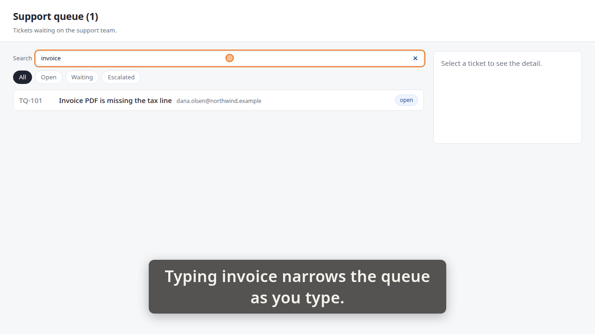
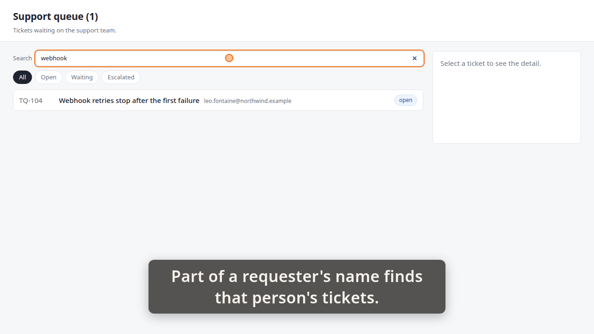
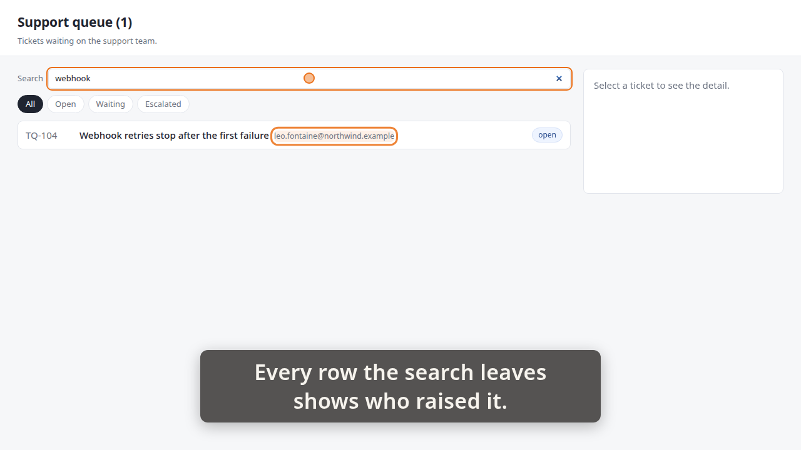

# Demo timeline

`demo.mp4` · Recorder · 20.5s · 19 beats

Written by the demo-video recorder on every clean exit — do not edit it by hand, re-record instead.

## Acceptance criteria

This take was recorded against a ticket. **The table below is what the storyboard *claimed*, not what it proved** — an `ac=` tag is a string its author typed, and whether the frames actually show the criterion is the reviewer's judgement, not this file's.

| criterion | claimed by | at | still |
|---|---|---:|---|
| **AC-1** — A search box above the queue narrows the list as you type, with no button to press. | beat 2 | 1.08 |  |
|  | beat 6 | 7.18 | `images/01-invoice.png` |
| **AC-3** — Search matches the requester as well as the title — typing part of a name or an address finds that person's tickets. | beat 7 | 7.23 |  |
|  | beat 12 | 14.59 | `images/02-requester.png` |
|  | beat 13 | 14.64 |  |
|  | beat 16 | 20.16 | `images/03-who.png` |

Every one of the 2 criteria has at least one beat claiming it. Whether those beats show what they claim is the reviewer's call.

13 beat(s) claim no criterion. That is ordinary — navigation, waits and captions that set the scene are not demonstrating anything in particular.

**The host's wall clock stepped 1 time(s) while this was recorded** (-1.36s in total). The times below are `time.monotonic()`; the recording is on that wall clock, so an instant this table puts at `t` sits at `t` plus the steps its own capture recorded before `t` — not at `t`, and not at `t` plus the total above, which is the correction for no single row. `timeline.json`'s `capture_clock` carries every step and the capture it was measured in; `frames/frames.md` says whether the review frames were cut with it applied.

| # | start | end | verb | target | caption |
|---:|---:|---:|---|---|---|
| 0 | 0.44 | 1.05 | `goto` | `/` |  |
| 1 | 1.05 | 1.08 | `wait_for` | `.ticket` |  |
| 2 | 1.08 | 4.42 | `caption` |  | Typing invoice narrows the queue as you type. |
| 3 | 4.42 | 5.66 | `type_into` | `#queue-search` | Typing invoice narrows the queue as you type. |
| 4 | 5.66 | 5.67 | `wait_for` | `.ticket[data-id='TQ-101']` | Typing invoice narrows the queue as you type. |
| 5 | 5.67 | 7.18 | `hold` |  | Typing invoice narrows the queue as you type. |
| 6 | 7.18 | 7.23 | `shot` | `01-invoice` | Typing invoice narrows the queue as you type. |
| 7 | 7.23 | 10.90 | `caption` |  | Part of a requester's name finds that person's tickets. |
| 8 | 10.90 | 11.82 | `click` | `#queue-search` | Part of a requester's name finds that person's tickets. |
| 9 | 11.83 | 13.07 | `type_into` | `#queue-search` | Part of a requester's name finds that person's tickets. |
| 10 | 13.07 | 13.08 | `wait_for` | `.ticket[data-id='TQ-104'] .ticket-requester` | Part of a requester's name finds that person's tickets. |
| 11 | 13.08 | 14.59 | `hold` |  | Part of a requester's name finds that person's tickets. |
| 12 | 14.59 | 14.64 | `shot` | `02-requester` | Part of a requester's name finds that person's tickets. |
| 13 | 14.64 | 18.31 | `caption` |  | Every row the search leaves shows who raised it. |
| 14 | 18.31 | 18.64 | `spotlight` | `.ticket[data-id='TQ-104'] .ticket-requester` | Every row the search leaves shows who raised it. |
| 15 | 18.64 | 20.16 | `hold` |  | Every row the search leaves shows who raised it. |
| 16 | 20.16 | 20.22 | `shot` | `03-who` | Every row the search leaves shows who raised it. |
| 17 | 20.22 | 20.80 | `spotlight` |  | Every row the search leaves shows who raised it. |
| 18 | 20.80 | 21.11 | `caption` |  |  |

## Stills

### 01-invoice — 7.18s

> Typing invoice narrows the queue as you type.

### 02-requester — 14.59s

> Part of a requester's name finds that person's tickets.

### 03-who — 20.16s

> Every row the search leaves shows who raised it.

