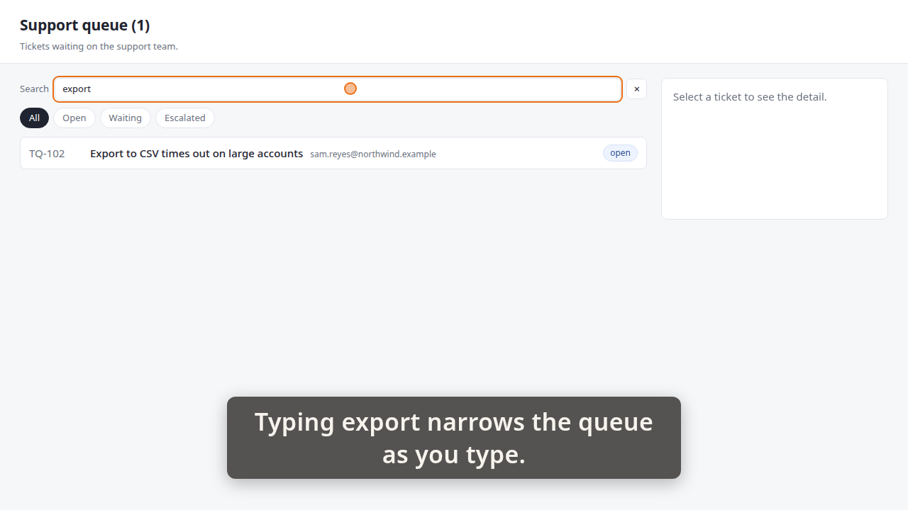
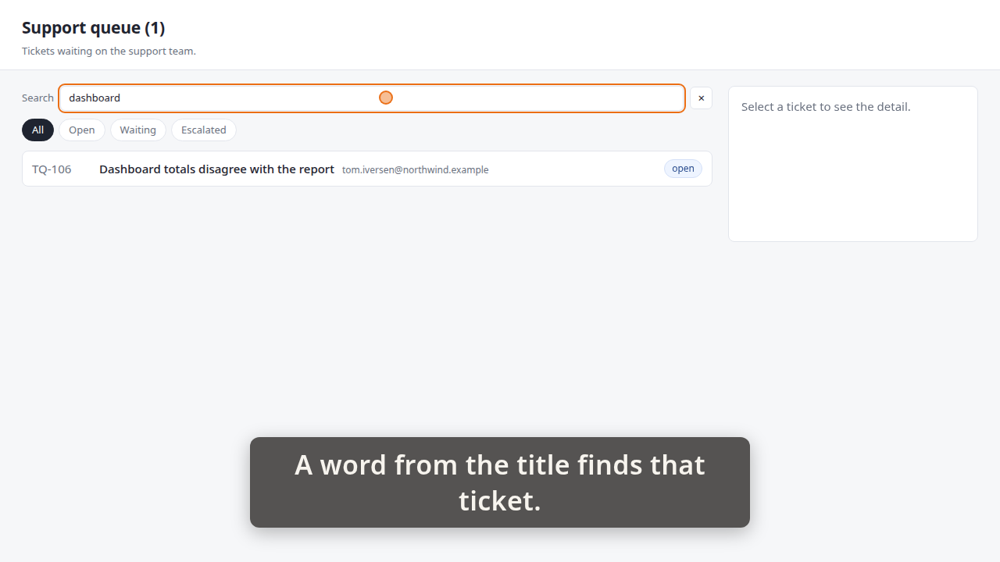
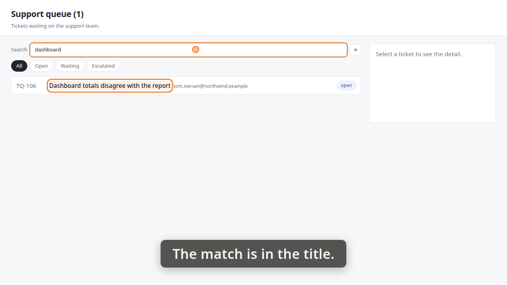

# Demo timeline

`demo.mp4` · Recorder · 19.5s · 19 beats

Written by the demo-video recorder on every clean exit — do not edit it by hand, re-record instead.

## Acceptance criteria

This take was recorded against a ticket. **The table below is what the storyboard *claimed*, not what it proved** — an `ac=` tag is a string its author typed, and whether the frames actually show the criterion is the reviewer's judgement, not this file's.

| criterion | claimed by | at | still |
|---|---|---:|---|
| **AC-1** — A search box above the queue narrows the list as you type, with no button to press. | beat 2 | 1.03 |  |
|  | beat 6 | 7.08 | `images/01-export.png` |
| **AC-2** — Search matches the ticket title — typing a word from the title narrows the queue to that ticket. | beat 7 | 7.12 |  |
|  | beat 12 | 14.22 | `images/02-dashboard.png` |
|  | beat 13 | 14.27 |  |
|  | beat 16 | 18.78 | `images/03-title.png` |

Every one of the 2 criteria has at least one beat claiming it. Whether those beats show what they claim is the reviewer's call.

13 beat(s) claim no criterion. That is ordinary — navigation, waits and captions that set the scene are not demonstrating anything in particular.

**The host's wall clock stepped 1 time(s) while this was recorded** (-1.19s in total). The times below are `time.monotonic()`; the recording is on that wall clock, so an instant this table puts at `t` sits at `t` plus the steps its own capture recorded before `t` — not at `t`, and not at `t` plus the total above, which is the correction for no single row. `timeline.json`'s `capture_clock` carries every step and the capture it was measured in; `frames/frames.md` says whether the review frames were cut with it applied.

| # | start | end | verb | target | caption |
|---:|---:|---:|---|---|---|
| 0 | 0.43 | 1.00 | `goto` | `/` |  |
| 1 | 1.00 | 1.03 | `wait_for` | `.ticket` |  |
| 2 | 1.03 | 4.36 | `caption` |  | Typing export narrows the queue as you type. |
| 3 | 4.36 | 5.55 | `type_into` | `#queue-search` | Typing export narrows the queue as you type. |
| 4 | 5.55 | 5.56 | `wait_for` | `.ticket[data-id='TQ-102']` | Typing export narrows the queue as you type. |
| 5 | 5.56 | 7.08 | `hold` |  | Typing export narrows the queue as you type. |
| 6 | 7.08 | 7.12 | `shot` | `01-export` | Typing export narrows the queue as you type. |
| 7 | 7.12 | 10.46 | `caption` |  | A word from the title finds that ticket. |
| 8 | 10.46 | 11.37 | `click` | `#queue-search` | A word from the title finds that ticket. |
| 9 | 11.37 | 12.69 | `type_into` | `#queue-search` | A word from the title finds that ticket. |
| 10 | 12.69 | 12.71 | `wait_for` | `.ticket[data-id='TQ-106']` | A word from the title finds that ticket. |
| 11 | 12.71 | 14.22 | `hold` |  | A word from the title finds that ticket. |
| 12 | 14.22 | 14.27 | `shot` | `02-dashboard` | A word from the title finds that ticket. |
| 13 | 14.27 | 16.92 | `caption` |  | The match is in the title. |
| 14 | 16.92 | 17.26 | `spotlight` | `.ticket[data-id='TQ-106'] .ticket-title` | The match is in the title. |
| 15 | 17.26 | 18.78 | `hold` |  | The match is in the title. |
| 16 | 18.78 | 18.84 | `shot` | `03-title` | The match is in the title. |
| 17 | 18.84 | 19.42 | `spotlight` |  | The match is in the title. |
| 18 | 19.42 | 19.73 | `caption` |  |  |

## Stills

### 01-export — 7.08s

> Typing export narrows the queue as you type.

### 02-dashboard — 14.22s

> A word from the title finds that ticket.

### 03-title — 18.78s

> The match is in the title.

