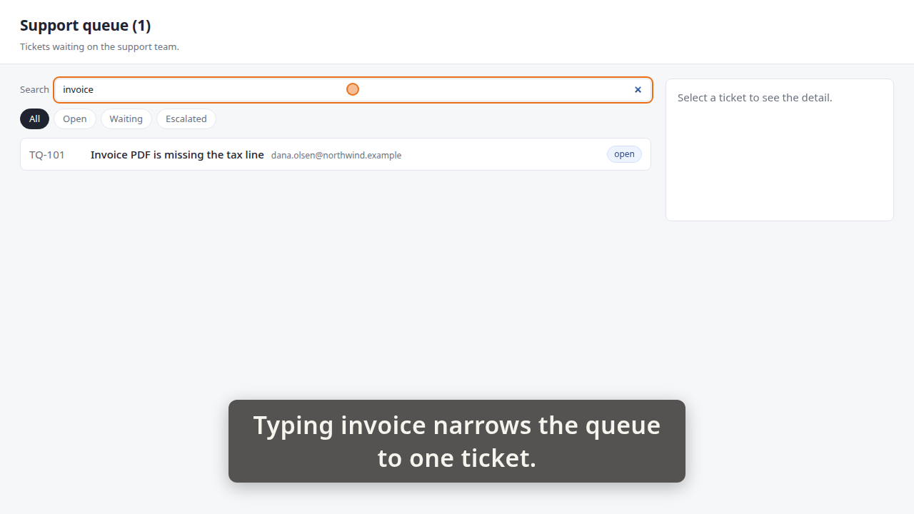
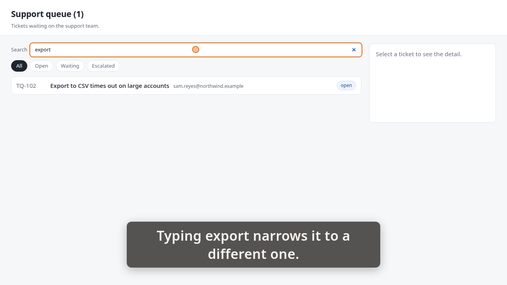
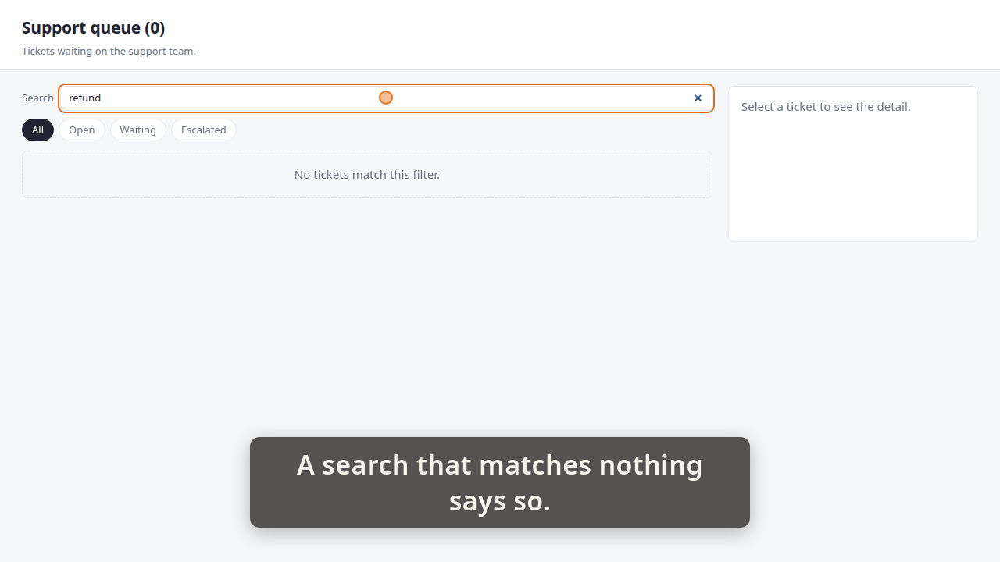

# Demo timeline

`demo.mp4` · Recorder · 21.1s · 20 beats

Written by the demo-video recorder on every clean exit — do not edit it by hand, re-record instead.

## Acceptance criteria

This take was recorded against a ticket. **The table below is what the storyboard *claimed*, not what it proved** — an `ac=` tag is a string its author typed, and whether the frames actually show the criterion is the reviewer's judgement, not this file's.

| criterion | claimed by | at | still |
|---|---|---:|---|
| **AC-1** — A search box above the queue narrows the list as you type, with no button to press. | beat 2 | 1.05 |  |
|  | beat 6 | 7.14 | `images/01-invoice.png` |
|  | beat 7 | 7.20 |  |
|  | beat 12 | 14.18 | `images/02-export.png` |
| **AC-2** — A search matching nothing shows a 'No tickets match this filter.' line instead of a blank queue. | beat 13 | 14.23 |  |
|  | beat 18 | 20.84 | `images/03-no-match.png` |

Every one of the 2 criteria has at least one beat claiming it. Whether those beats show what they claim is the reviewer's call.

14 beat(s) claim no criterion. That is ordinary — navigation, waits and captions that set the scene are not demonstrating anything in particular.

**The host's wall clock stepped 1 time(s) while this was recorded** (-1.02s in total). The times below are `time.monotonic()`; the recording is on that wall clock, so an instant this table puts at `t` sits at `t` plus the steps its own capture recorded before `t` — not at `t`, and not at `t` plus the total above, which is the correction for no single row. `timeline.json`'s `capture_clock` carries every step and the capture it was measured in; `frames/frames.md` says whether the review frames were cut with it applied.

| # | start | end | verb | target | caption |
|---:|---:|---:|---|---|---|
| 0 | 0.45 | 1.02 | `goto` | `/` |  |
| 1 | 1.02 | 1.05 | `wait_for` | `.ticket` |  |
| 2 | 1.05 | 4.40 | `caption` |  | Typing invoice narrows the queue to one ticket. |
| 3 | 4.40 | 5.62 | `type_into` | `#queue-search` | Typing invoice narrows the queue to one ticket. |
| 4 | 5.62 | 5.63 | `wait_for` | `.ticket[data-id='TQ-101']` | Typing invoice narrows the queue to one ticket. |
| 5 | 5.63 | 7.14 | `hold` |  | Typing invoice narrows the queue to one ticket. |
| 6 | 7.14 | 7.20 | `shot` | `01-invoice` | Typing invoice narrows the queue to one ticket. |
| 7 | 7.20 | 10.53 | `caption` |  | Typing export narrows it to a different one. |
| 8 | 10.53 | 11.45 | `click` | `#queue-search` | Typing export narrows it to a different one. |
| 9 | 11.45 | 12.66 | `type_into` | `#queue-search` | Typing export narrows it to a different one. |
| 10 | 12.66 | 12.67 | `wait_for` | `.ticket[data-id='TQ-102']` | Typing export narrows it to a different one. |
| 11 | 12.67 | 14.18 | `hold` |  | Typing export narrows it to a different one. |
| 12 | 14.18 | 14.23 | `shot` | `02-export` | Typing export narrows it to a different one. |
| 13 | 14.23 | 17.22 | `caption` |  | A search that matches nothing says so. |
| 14 | 17.22 | 18.12 | `click` | `#queue-search` | A search that matches nothing says so. |
| 15 | 18.13 | 19.32 | `type_into` | `#queue-search` | A search that matches nothing says so. |
| 16 | 19.32 | 19.33 | `wait_for` | `.queue-empty` | A search that matches nothing says so. |
| 17 | 19.33 | 20.84 | `hold` |  | A search that matches nothing says so. |
| 18 | 20.84 | 20.89 | `shot` | `03-no-match` | A search that matches nothing says so. |
| 19 | 20.89 | 21.21 | `caption` |  |  |

## Stills

### 01-invoice — 7.14s

> Typing invoice narrows the queue to one ticket.

### 02-export — 14.18s

> Typing export narrows it to a different one.

### 03-no-match — 20.84s

> A search that matches nothing says so.

