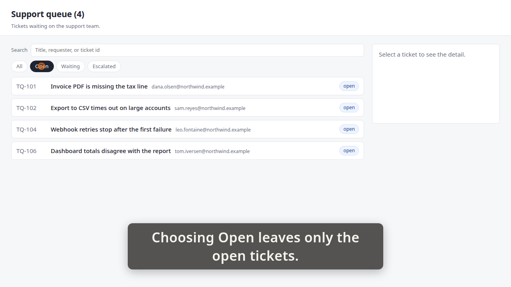
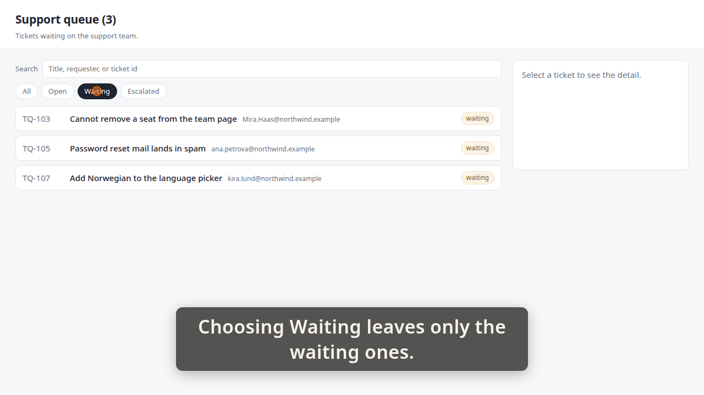
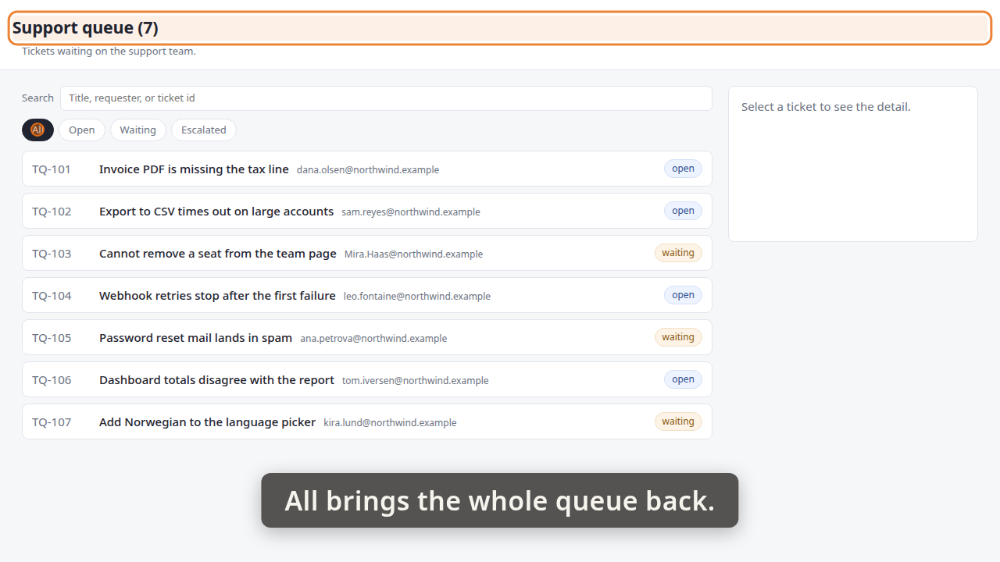

# Demo timeline

`demo.mp4` · Recorder · 18.3s · 20 beats

Written by the demo-video recorder on every clean exit — do not edit it by hand, re-record instead.

## Acceptance criteria

This take was recorded against a ticket. **The table below is what the storyboard *claimed*, not what it proved** — an `ac=` tag is a string its author typed, and whether the frames actually show the criterion is the reviewer's judgement, not this file's.

| criterion | claimed by | at | still |
|---|---|---:|---|
| **AC-1** — Choosing a status above the queue narrows the list to the tickets with that status. | beat 2 | 1.03 |  |
|  | beat 6 | 6.46 | `images/01-open.png` |
|  | beat 7 | 6.52 |  |
|  | beat 11 | 11.96 | `images/02-waiting.png` |
| **AC-2** — Choosing All restores the whole queue, and the heading above it names the queue being listed. | beat 12 | 12.01 |  |
|  | beat 17 | 17.45 | `images/03-all.png` |

Every one of the 2 criteria has at least one beat claiming it. Whether those beats show what they claim is the reviewer's call.

14 beat(s) claim no criterion. That is ordinary — navigation, waits and captions that set the scene are not demonstrating anything in particular.

**The host's wall clock stepped 1 time(s) while this was recorded** (-1.04s in total). The times below are `time.monotonic()`; the recording is on that wall clock, so an instant this table puts at `t` sits at `t` plus the steps its own capture recorded before `t` — not at `t`, and not at `t` plus the total above, which is the correction for no single row. `timeline.json`'s `capture_clock` carries every step and the capture it was measured in; `frames/frames.md` says whether the review frames were cut with it applied.

| # | start | end | verb | target | caption |
|---:|---:|---:|---|---|---|
| 0 | 0.43 | 1.00 | `goto` | `/` |  |
| 1 | 1.00 | 1.03 | `wait_for` | `.ticket` |  |
| 2 | 1.03 | 4.02 | `caption` |  | Choosing Open leaves only the open tickets. |
| 3 | 4.02 | 4.93 | `click` | `button[data-status='open']` | Choosing Open leaves only the open tickets. |
| 4 | 4.93 | 4.95 | `wait_for` | `.ticket[data-id='TQ-101']` | Choosing Open leaves only the open tickets. |
| 5 | 4.95 | 6.46 | `hold` |  | Choosing Open leaves only the open tickets. |
| 6 | 6.46 | 6.52 | `shot` | `01-open` | Choosing Open leaves only the open tickets. |
| 7 | 6.52 | 9.52 | `caption` |  | Choosing Waiting leaves only the waiting ones. |
| 8 | 9.52 | 10.43 | `click` | `button[data-status='waiting']` | Choosing Waiting leaves only the waiting ones. |
| 9 | 10.43 | 10.45 | `wait_for` | `.ticket[data-id='TQ-103']` | Choosing Waiting leaves only the waiting ones. |
| 10 | 10.45 | 11.96 | `hold` |  | Choosing Waiting leaves only the waiting ones. |
| 11 | 11.96 | 12.01 | `shot` | `02-waiting` | Choosing Waiting leaves only the waiting ones. |
| 12 | 12.01 | 14.66 | `caption` |  | All brings the whole queue back. |
| 13 | 14.66 | 15.58 | `click` | `button[data-status='all']` | All brings the whole queue back. |
| 14 | 15.58 | 15.59 | `wait_for` | `.ticket[data-id='TQ-101']` | All brings the whole queue back. |
| 15 | 15.59 | 15.93 | `spotlight` | `#queue-heading` | All brings the whole queue back. |
| 16 | 15.93 | 17.45 | `hold` |  | All brings the whole queue back. |
| 17 | 17.45 | 17.52 | `shot` | `03-all` | All brings the whole queue back. |
| 18 | 17.52 | 18.09 | `spotlight` |  | All brings the whole queue back. |
| 19 | 18.09 | 18.40 | `caption` |  |  |

## Stills

### 01-open — 6.46s

> Choosing Open leaves only the open tickets.

### 02-waiting — 11.96s

> Choosing Waiting leaves only the waiting ones.

### 03-all — 17.45s

> All brings the whole queue back.

