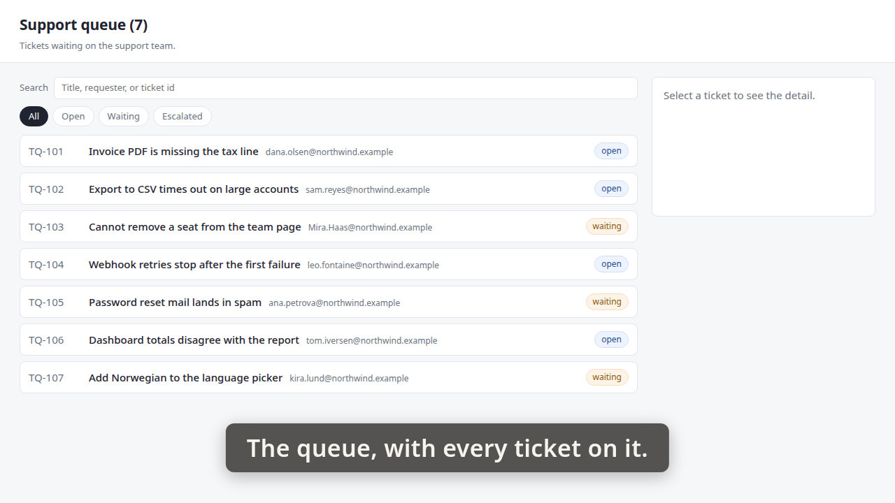
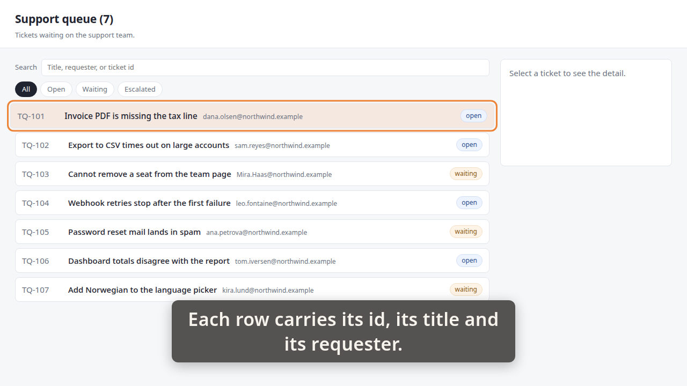
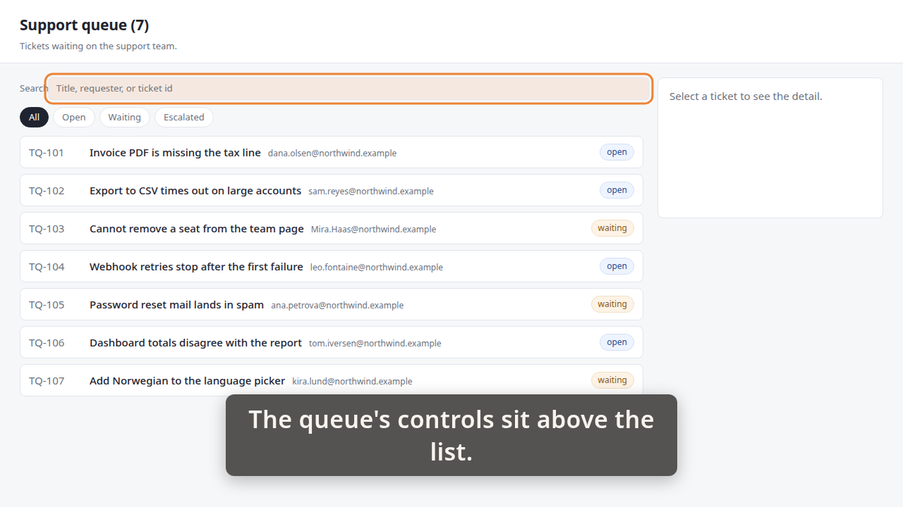

# Demo timeline

`demo.mp4` · Recorder · 17.9s · 17 beats

Written by the demo-video recorder on every clean exit — do not edit it by hand, re-record instead.

## Acceptance criteria

This take was recorded against a ticket. **The table below is what the storyboard *claimed*, not what it proved** — an `ac=` tag is a string its author typed, and whether the frames actually show the criterion is the reviewer's judgement, not this file's.

| criterion | claimed by | at | still |
|---|---|---:|---|
| **AC-1** — The queue lists every ticket with its id, its title and the person who raised it. | beat 2 | 1.08 |  |
|  | beat 4 | 5.59 | `images/01-queue.png` |
|  | beat 5 | 5.65 |  |
|  | beat 9 | 11.55 | `images/02-row.png` |
| **AC-2** — A search box above the queue narrows the list as you type, with no button to press. | beat 11 | 12.20 |  |
|  | beat 14 | 17.05 | `images/03-controls.png` |

Every one of the 2 criteria has at least one beat claiming it. Whether those beats show what they claim is the reviewer's call.

11 beat(s) claim no criterion. That is ordinary — navigation, waits and captions that set the scene are not demonstrating anything in particular.

**The host's wall clock stepped 1 time(s) while this was recorded** (-1.03s in total). The times below are `time.monotonic()`; the recording is on that wall clock, so an instant this table puts at `t` sits at `t` plus the steps its own capture recorded before `t` — not at `t`, and not at `t` plus the total above, which is the correction for no single row. `timeline.json`'s `capture_clock` carries every step and the capture it was measured in; `frames/frames.md` says whether the review frames were cut with it applied.

| # | start | end | verb | target | caption |
|---:|---:|---:|---|---|---|
| 0 | 0.48 | 1.05 | `goto` | `/` |  |
| 1 | 1.05 | 1.08 | `wait_for` | `.ticket` |  |
| 2 | 1.08 | 4.08 | `caption` |  | The queue, with every ticket on it. |
| 3 | 4.08 | 5.59 | `hold` |  | The queue, with every ticket on it. |
| 4 | 5.59 | 5.65 | `shot` | `01-queue` | The queue, with every ticket on it. |
| 5 | 5.65 | 9.66 | `caption` |  | Each row carries its id, its title and its requester. |
| 6 | 9.66 | 9.99 | `spotlight` | `.ticket[data-id='TQ-101']` | Each row carries its id, its title and its requester. |
| 7 | 9.99 | 10.02 | `wait_for` | `.ticket[data-id='TQ-101'] .ticket-requester` | Each row carries its id, its title and its requester. |
| 8 | 10.02 | 11.55 | `hold` |  | Each row carries its id, its title and its requester. |
| 9 | 11.55 | 11.63 | `shot` | `02-row` | Each row carries its id, its title and its requester. |
| 10 | 11.63 | 12.20 | `spotlight` |  | Each row carries its id, its title and its requester. |
| 11 | 12.20 | 15.19 | `caption` |  | The queue's controls sit above the list. |
| 12 | 15.19 | 15.53 | `spotlight` | `#queue-search` | The queue's controls sit above the list. |
| 13 | 15.53 | 17.05 | `hold` |  | The queue's controls sit above the list. |
| 14 | 17.05 | 17.13 | `shot` | `03-controls` | The queue's controls sit above the list. |
| 15 | 17.13 | 17.69 | `spotlight` |  | The queue's controls sit above the list. |
| 16 | 17.69 | 18.00 | `caption` |  |  |

## Stills

### 01-queue — 5.59s

> The queue, with every ticket on it.

### 02-row — 11.55s

> Each row carries its id, its title and its requester.

### 03-controls — 17.05s

> The queue's controls sit above the list.

